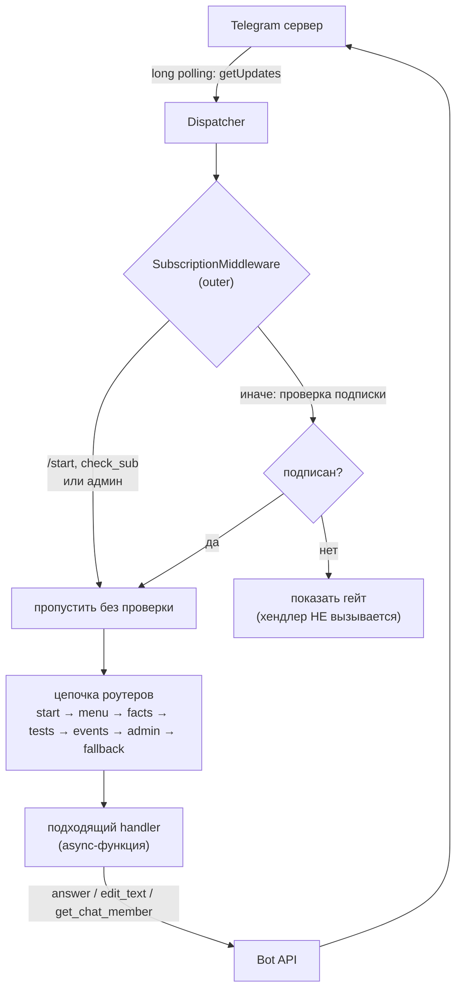
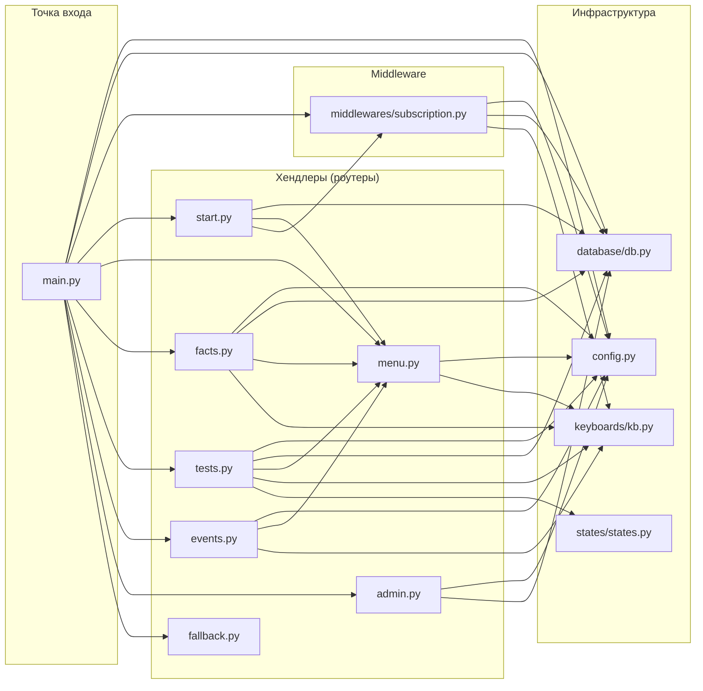
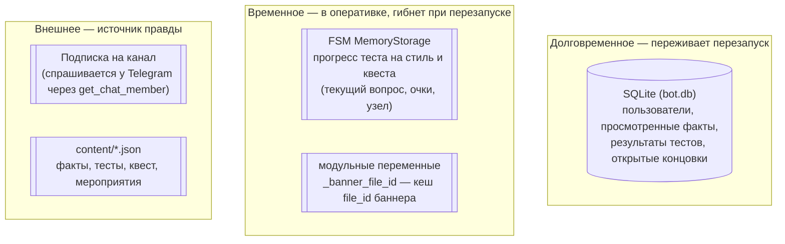

# Лекция 0. Обзор архитектуры

**Цель:** увидеть бота целиком — какие у него части, как между ними течёт
управление и какие идеи держат всю конструкцию вместе. Дальше каждая подсистема
разбирается отдельно; здесь — карта местности.

**Предполагается, что вы знаете:** Python и `async/await`. Про aiogram — ничего,
с него и начнём.

---

## 1. Что вообще делает бот

Бот обслуживает рок-сообщество вокруг Telegram-канала. Его бизнес-задача
простая и измеримая: **превратить случайного гостя в подписчика канала**, а потом
удерживать его развлекательным контентом.

Отсюда два пласта функциональности:

1. **Гейт подписки.** Пока человек не подписан на канал, бот не пускает его ни в
   один раздел — показывает экран «подпишись». Это и есть конверсия: канал —
   единственная дверь внутрь.
2. **Контент после гейта.** Подписался → открывается меню: плейлист дня, рандомные
   факты без повторов, три теста (музыкант по знаку зодиака, тест на стиль,
   квест-бродилка «Спаси концерт»), список мероприятий, ссылка на чат. Плюс
   скрытая команда `/stats` для админов.

Запомните эту бизнес-логику — техническая архитектура из неё прямо вытекает.
Например, гейт подписки реализован как **middleware** именно потому, что это
сквозное требование «перед любым действием проверь подписку».

---

## 2. Объектная модель aiogram за тридцать секунд

Чтобы карта читалась, нужны четыре слова из словаря aiogram. Подробно — в лекции 1,
здесь по одному предложению:

- **Update (апдейт)** — любое событие от Telegram: пришло сообщение, нажали
  inline-кнопку, кто-то вступил в чат. Бот живёт, реагируя на поток апдейтов.
- **Bot** — клиент к Telegram Bot API. Через него вы *отправляете* (ответить,
  отредактировать, проверить подписку).
- **Dispatcher (`dp`)** — диспетчер: *принимает* апдейты и решает, какой код их
  обработает. Это «мозг» маршрутизации.
- **Router / Handler** — роутер группирует хендлеры; хендлер — обычная
  `async`-функция, которая отрабатывает конкретное событие.

Поток в одну строку: **Telegram → Bot API → Dispatcher → (middleware) → Router →
Handler → ответ через Bot → Telegram**.

---

## 3. Путь одного апдейта (главная диаграмма курса)

Это самая важная схема. Почти всё, что вы будете писать в боте, — это вставка
своего кода в одну из точек этого конвейера.

Что здесь принципиально:

- **Middleware стоит ДО роутеров.** Это «вахтёр»: он успевает отклонить апдейт
  раньше, чем тот дойдёт до любого хендлера. Поэтому ни в одном разделе не нужно
  вручную проверять подписку — она уже проверена централизованно (лекция 5).
- **Роутеры проверяются по порядку включения.** Первый подошедший хендлер
  забирает апдейт. Порядок не косметический — он определяет логику (лекция 3).
- **`fallback` — последний.** Он ловит всё, что не поймали остальные (например,
  нажатие на кнопку из старого сообщения). Если бы он стоял раньше — перехватывал
  бы живые события (лекция 9).

---

## 4. Карта модулей и зависимостей

Проект разложен по папкам не ради красоты, а чтобы зависимости текли в одну
сторону и не было циклов. Кто на кого опирается:

Несколько наблюдений, которые стоит присвоить:

- **`config.py` и `database/db.py` — это листья.** Они ни от кого внутри проекта
  не зависят (только от внешних библиотек). На них опираются все. Так и должно
  быть: инфраструктурный слой не знает про прикладной.
- **`menu.py` — это ещё и UI-утилита.** Заметьте, что `facts`, `tests`, `events`
  импортируют из него `safe_edit`. То есть `menu.py` хранит не только экран меню,
  но и общий помощник «показать текст под кнопкой» (лекция 9). Это сознательное
  решение: вынести общий приём редактирования сообщения в один модуль.
- **`keyboards/kb.py` — единственный источник `callback_data`.** Все клавиатуры
  собраны там, чтобы строки коллбэков (`menu_fact`, `quest:S0`, …) не
  расползались по проекту и не разъезжались с хендлерами (лекция 4).
- **Циклов нет.** `start.py` импортирует `menu.py`, но не наоборот. Это важно:
  Python не любит циклические импорты, а чистая иерархия их исключает.

---

## 5. Где хранится состояние

В боте уживаются **три разных хранилища**, и важно с самого начала понимать, что
для чего:

- **SQLite** — то, что должно пережить рестарт: кто такой пользователь, какие
  факты он уже видел (чтобы не повторяться), какие концовки квеста открыл
  (лекция 6).
- **FSM-хранилище** — короткоживущий прогресс пошагового сценария: на каком вопросе
  теста человек сейчас и сколько очков набрал. Здесь это `MemoryStorage` — память
  процесса, поэтому при перезапуске недопройденные тесты обнуляются. Для такого
  бота это допустимо (лекция 7).
- **Подписка не хранится как истина в БД.** Колонка `is_subscribed` есть, но это
  лишь кэш для статистики; *настоящий* ответ на вопрос «подписан ли» всегда
  спрашивается у Telegram в реальном времени. Человек мог отписаться минуту назад —
  БД об этом не знает, а `get_chat_member` знает (лекция 5).
- **Контент — это тоже состояние, и оно снаружи кода.** Файлы `content/*.json`
  читаются заново на каждый показ. Это и есть тот самый принцип «код vs контент».

---

## 6. Принцип «код vs контент»

Это архитектурное решение, ради которого стоит остановиться, потому что оно
влияет на множество мелких выборов в проекте.

**Идея:** программа знает *как* показывать факт, вопрос, узел квеста, — но *что
именно* показать, лежит в JSON-файле снаружи. Владелец канала редактирует JSON и
видит изменения без перезапуска и без программиста.

Где это проявляется:

- `config.load_content("facts.json")` открывает и парсит файл **на каждый запрос**,
  а не один раз при старте. Цена — лишнее чтение с диска; выгода — правки
  подхватываются мгновенно (лекция 2).
- Квест — это не `if/elif` по сюжету, а **универсальный движок графа**, который
  отрисовывает любой граф из `quest_concert.json`. Хотите другой сюжет — меняете
  JSON, код не трогаете (лекция 8).
- Тест на стиль не знает названий стилей: он просто складывает очки из поля
  `scores` и берёт максимум. Стили заданы в JSON (лекция 7).

Обратная сторона, о которой важно помнить: раз контент снаружи и может быть
кривым, код обязан быть **устойчивым к плохому контенту**. Поэтому почти в каждом
хендлере есть проверка «файла нет / поле пустое → показать аккуратную заглушку, не
упасть». Это не перестраховка, это прямое следствие выбранной архитектуры.

---

## 7. Сквозные приёмы, которые встретятся всюду

Несколько привычек кода, которые повторяются из модуля в модуль. Узнав их сейчас,
вы будете видеть их в каждой лекции:

- **Безопасность при работе с Telegram.** Любой вызов API может бросить
  `TelegramBadRequest` (сообщение устарело, текст не изменился, нет прав). Код это
  ловит и деградирует мягко, а не падает.
- **HTML-экранирование пользовательских и контентных строк.** Бот работает в
  режиме `parse_mode=HTML`, поэтому любой текст из JSON прогоняется через
  `html.escape`, иначе символ `<` сломает разметку (лекции 2, 9).
- **Идемпотентные записи в БД.** «Отметить факт просмотренным» — это
  `INSERT OR IGNORE`: повтор не ошибка, просто ничего не происходит (лекция 6).
- **Клавиатуры — функции, а не константы.** Каждая клавиатура собирается функцией
  в `kb.py`. Это позволяет строить их динамически (например, кнопки вариантов из
  данных теста) и держит `callback_data` в одном месте (лекция 4).

---

## 8. Маршрут чтения дальше

Дальше идём снизу вверх по стеку:

1. **Лекция 1** — запустим бота: `Bot`, `Dispatcher`, polling, `main.py`. Поймём
   конвейер из раздела 3 в коде.
2. **Лекция 2** — настройки и контент: откуда берутся токен, ссылки и JSON.
3. **Лекции 3–4** — как апдейт находит свой хендлер и как устроены кнопки.
4. **Лекция 5** — гейт подписки как middleware (вахтёр из диаграммы).
5. **Лекция 6** — что и как сохраняется в SQLite.
6. **Лекции 7–8** — пошаговые сценарии: FSM и движок квеста.
7. **Лекции 9–10** — UX-тонкости сообщений и вывод бота в эксплуатацию.

---

### Итоги лекции

- Бизнес-цель — конверсия в подписчики — напрямую породила архитектуру (гейт как
  middleware).
- Апдейт идёт по конвейеру `Telegram → Dispatcher → middleware → роутеры → handler
  → ответ`; почти весь ваш код вставляется в одну из этих точек.
- Зависимости текут в одну сторону: инфраструктура (`config`, `db`) — листья,
  хендлеры — вершина, циклов нет.
- Состояние живёт в трёх местах: SQLite (надолго), FSM-память (на время сценария),
  Telegram/JSON (источник правды о подписке и контенте).
- Главная идея — «код vs контент»: логика в Python, наполнение в JSON/.env,
  а значит код обязан быть устойчив к плохому контенту.

**Дальше:** [Лекция 1. Основы aiogram: Bot, Dispatcher, polling →](01-aiogram-basics.md)
