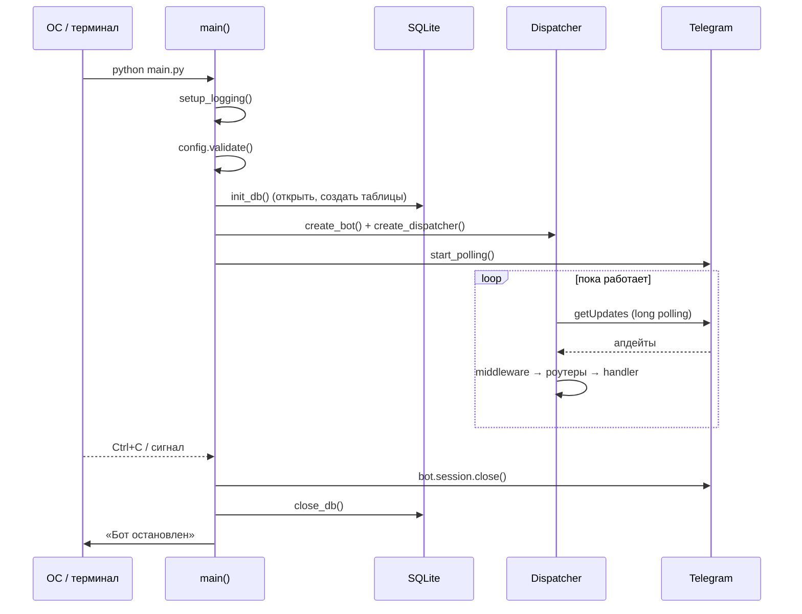

# Лекция 1. Основы aiogram: Bot, Dispatcher, polling

**Цель:** понять объектную модель aiogram 3 и прочитать точку входа `main.py`
строка за строкой. После этой лекции вы сможете запустить минимального бота с нуля
и объясните, что делает каждая строка.

**Нужно заранее:** [Лекция 0](00-architecture-overview.md) (общая картина),
уверенный Python и `async/await`.

---

## 1. Telegram Bot API и место aiogram

Бот общается с Telegram не напрямую, а через **Bot API** — HTTP-интерфейс. Грубо
есть два направления обмена:

- **Вы → Telegram:** вызываете методы (`sendMessage`, `editMessageText`,
  `getChatMember`, …). Это обычные HTTPS-запросы.
- **Telegram → вы:** Telegram копит для вашего бота **апдейты** (входящие события)
  и отдаёт их одним из двух способов — *long polling* (вы сами спрашиваете «что
  нового?») или *webhook* (Telegram стучится на ваш HTTPS-адрес).

Писать это руками — боль: сериализация, типы, переподключения, разбор того, что за
событие пришло. **aiogram** — асинхронный фреймворк, который берёт это на себя и
даёт удобную модель: типизированные объекты (`Message`, `CallbackQuery`),
маршрутизацию (`Router`), фильтры, middleware и встроенный FSM.

Версия в проекте — `aiogram==3.28.2` (см. `requirements.txt`). Это важно: aiogram 2
и aiogram 3 различаются принципиально (роутеры, фильтры, способ регистрации
хендлеров). Всё в этом курсе — про 3.x.

---

## 2. Что такое апдейт

**Update** — контейнер «произошло событие». Внутри ровно одно из множества полей
заполнено в зависимости от типа события. Для нашего бота важны два:

- `message` — пользователь прислал сообщение (текст, команда `/start`, фото…).
- `callback_query` — пользователь нажал **inline-кнопку** под сообщением.

Почти весь бот реагирует именно на эти два типа. Команда `/start` и `/stats` —
это `message`; всё меню, факты, тесты, квест — это `callback_query` (нажатия
кнопок). Поэтому в `main.py` middleware вешается ровно на два потока:
`dp.message` и `dp.callback_query`.

Ключевая ментальная модель: **бот — это не скрипт «сверху вниз», а набор реакций
на апдейты.** Вы не пишете «программа идёт сюда, потом туда» — вы описываете «когда
придёт вот такое событие, выполни вот эту функцию». Управление приходит извне.

---

## 3. Bot и Dispatcher: кто за что отвечает

Два центральных объекта, и их роли важно не путать:

| Объект | Роль | Чем оперирует |
|--------|------|---------------|
| `Bot` | **исходящая** связь с Telegram | методы API: `answer`, `edit_text`, `get_chat_member`, `send_photo`… |
| `Dispatcher` (`dp`) | **входящая** маршрутизация апдейтов | роутеры, middleware, FSM-хранилище |

Метафора: `Dispatcher` — это диспетчер на вышке, который принимает входящие борта и
говорит каждому, к какому терминалу рулить. `Bot` — рация, через которую вы
передаёте сообщения наружу. Один принимает, другой отправляет.

В хендлерах вы почти всегда дёргаете `Bot` неявно: `message.answer(...)` под
капотом вызывает `bot.send_message(...)` с уже подставленным `chat_id`. А сам
`bot` доступен и явно — например, `message.bot.get_chat_member(...)` в проверке
подписки.

---

## 4. Точка входа `main.py` — разбор

Весь запуск собран в одном файле. Прочитаем его по частям.

### 4.1. Импорты и логгер

```python
import asyncio
import logging

from aiogram import Bot, Dispatcher
from aiogram.client.default import DefaultBotProperties
from aiogram.enums import ParseMode
from aiogram.fsm.storage.memory import MemoryStorage

import config
from database import db
from handlers import admin, events, facts, fallback, menu, start, tests
from middlewares.subscription import SubscriptionMiddleware

logger = logging.getLogger(__name__)
```

Обратите внимание, *что* импортируется: каждый модуль из `handlers/` — это
отдельный роутер, который сейчас будет подключён к диспетчеру. `MemoryStorage` —
хранилище для FSM (лекция 7). `DefaultBotProperties` и `ParseMode` — для настройки
бота по умолчанию (см. ниже).

### 4.2. Логирование

```python
def setup_logging() -> None:
    """Логи уровня INFO в консоль и в файл."""
    logging.basicConfig(
        level=logging.INFO,
        format="%(asctime)s | %(levelname)s | %(name)s | %(message)s",
        handlers=[
            logging.StreamHandler(),
            logging.FileHandler(config.LOG_FILE, encoding="utf-8"),
        ],
    )
```

Два обработчика: в консоль (`StreamHandler`) и в файл (`FileHandler`, `bot.log`).
Уровень `INFO` — увидим служебные сообщения самого aiogram (старт polling,
принятые апдейты при отладке) и свои `logger.info/warning`. `encoding="utf-8"`
обязателен — логи на русском.

Зачем вообще файл логов? Когда бот крутится на сервере, консоль вы не видите.
`bot.log` — единственный способ понять постфактум, что пошло не так (например,
варнинг «не удалось проверить подписку» из middleware).

### 4.3. Фабрика бота

```python
def create_bot() -> Bot:
    return Bot(
        token=config.BOT_TOKEN,
        default=DefaultBotProperties(parse_mode=ParseMode.HTML),
    )
```

`token` — выданный @BotFather ключ (из `.env`, лекция 2). Главное здесь —
`DefaultBotProperties(parse_mode=ParseMode.HTML)`. Это значит: **все** исходящие
сообщения по умолчанию парсятся как HTML, и можно писать `<b>жирный</b>`,
`<i>курсив</i>`, `<a href="...">ссылка</a>` без указания `parse_mode` в каждом
вызове.

Это решение тянет за собой последствие на весь проект: раз всё — HTML, любой текст
из внешнего источника (факт, ответ теста, название мероприятия) нужно **экранировать**
через `html.escape`, иначе символ `<` в контенте сломает разметку и Telegram
вернёт ошибку. Отсюда `import html` и `html.escape(...)` во многих хендлерах
(лекции 2, 9).

> В aiogram 3 это правильный способ задать `parse_mode` глобально. Передавать
> `parse_mode=` прямо в `Bot(...)` в новых версиях нельзя — он переехал в
> `DefaultBotProperties`. Это частая ошибка при переносе старого кода.

### 4.4. Фабрика диспетчера

```python
def create_dispatcher() -> Dispatcher:
    dp = Dispatcher(storage=MemoryStorage())

    # Гейт подписки — на каждое сообщение и нажатие кнопки.
    gate = SubscriptionMiddleware()
    dp.message.outer_middleware(gate)
    dp.callback_query.outer_middleware(gate)

    # start (/start и check_sub) включаем первым.
    dp.include_router(start.router)
    dp.include_router(menu.router)
    dp.include_router(facts.router)
    dp.include_router(tests.router)
    dp.include_router(events.router)
    dp.include_router(admin.router)
    # Фолбэк для устаревших кнопок — строго последним.
    dp.include_router(fallback.router)
    return dp
```

Здесь собирается весь конвейер из [Лекции 0, раздел 3](00-architecture-overview.md):

1. `Dispatcher(storage=MemoryStorage())` — создаём диспетчер и сразу даём ему
   хранилище FSM. Без `storage` FSM работать не будет (лекция 7).
2. **Middleware вешается на два потока** — `dp.message` и `dp.callback_query` — как
   `outer_middleware`. Outer значит «до фильтров роутеров», то есть до того, как
   апдейт начнут разбирать хендлеры. Именно поэтому гейт успевает всех проверить
   (лекция 5).
3. **Роутеры включаются по порядку.** Порядок — это приоритет: `start` первым,
   `fallback` последним. Почему именно так — целиком лекция 3. Сейчас достаточно
   запомнить: первый подошедший хендлер забирает апдейт, остальные не вызываются.

Заметьте архитектурный приём: `create_bot` и `create_dispatcher` — отдельные
функции-фабрики, а не код «навалом» в `main`. Это делает сборку тестируемой и
читаемой: видно ровно две вещи — «как настроен бот» и «как настроена
маршрутизация».

### 4.5. Главная корутина

```python
async def main() -> None:
    setup_logging()
    config.validate()  # упадём с понятной ошибкой, если .env не заполнен

    await db.init_db()
    bot = create_bot()
    dp = create_dispatcher()

    try:
        logger.info("Бот запускается (long polling)...")
        await dp.start_polling(bot)
    finally:
        await bot.session.close()
        await db.close_db()
        logger.info("Бот остановлен.")
```

Порядок шагов продуман:

1. `setup_logging()` — первым делом, чтобы всё дальнейшее уже логировалось.
2. `config.validate()` — проверяем обязательные настройки (токен, канал). Если
   `.env` пуст — падаем сразу и с понятным текстом, а не где-то в середине работы
   с загадочной ошибкой (лекция 2).
3. `await db.init_db()` — открываем соединение с SQLite и создаём таблицы, если их
   нет. Делается до старта polling: к моменту первого апдейта база обязана быть
   готова (лекция 6).
4. `await dp.start_polling(bot)` — **блокирующий** вызов: запускает бесконечный
   цикл «спроси у Telegram апдейты → разведи по хендлерам». Здесь программа и живёт
   всё время.
5. **`try/finally`** — гарантия чистого завершения. Что бы ни случилось (Ctrl+C,
   исключение), мы закроем HTTP-сессию бота и соединение с БД. Без этого можно
   оставить висящие сессии и незакрытый файл базы.

### 4.6. Запуск процесса

```python
if __name__ == "__main__":
    try:
        asyncio.run(main())
    except (KeyboardInterrupt, SystemExit):
        logging.getLogger(__name__).info("Выход по сигналу.")
```

`asyncio.run(main())` создаёт event loop, крутит в нём `main()` и закрывает loop
по завершении. Перехват `KeyboardInterrupt`/`SystemExit` — чтобы Ctrl+C на сервере
не вываливал безобразный traceback, а писал аккуратное «Выход по сигналу».

---

## 5. Жизненный цикл процесса целиком



---

## 6. Long polling vs webhook

Бот работает в режиме **long polling**: процесс сам периодически спрашивает у
Telegram «есть апдейты?» и держит соединение открытым, пока они не появятся (отсюда
«long» — долгий запрос). Управляет этим один вызов `dp.start_polling(bot)`.

Почему polling выбран по умолчанию:

- **Не нужен публичный адрес и SSL.** Запускается где угодно — хоть на ноутбуке,
  хоть на дешёвом VPS, хоть за NAT. Для разработки это незаменимо.
- **Проще.** Одна строка вместо поднятия веб-сервера.

Минус — масштабирование: один процесс тянет поток апдейтов сам. Для канального
бота с развлекательным контентом этого с запасом достаточно.

Альтернатива — **webhook**: вы регистрируете HTTPS-URL, и Telegram сам шлёт
апдейты на него POST-запросами. Нужен домен с валидным сертификатом и веб-сервер.
Это удобнее для больших нагрузок и «бессерверных» деплоев. Переключение разбираем
в [лекции 10](10-deploy-and-extend.md) — там же про важный нюанс: polling и webhook
взаимоисключающи, нельзя держать оба.

---

## 7. Минимальный бот для сравнения

Чтобы увидеть, что `main.py` — это «обвес» вокруг очень маленького ядра, вот
минимальный рабочий бот на aiogram 3:

```python
import asyncio
from aiogram import Bot, Dispatcher
from aiogram.filters import CommandStart
from aiogram.types import Message

dp = Dispatcher()

@dp.message(CommandStart())
async def start(message: Message):
    await message.answer("Привет!")

async def main():
    bot = Bot("ТОКЕН")
    await dp.start_polling(bot)

asyncio.run(main())
```

Всё, что есть в нашем проекте сверх этого, — не «магия aiogram», а **инженерия**:
конфиг, БД, middleware, разбиение на роутеры, логи, чистое завершение. Ядро же —
ровно эти несколько строк. Полезно держать это в голове: фреймворк маленький,
сложность — в вашей организации кода.

---

### Итоги лекции

- Бот реагирует на поток **апдейтов**; для нас это `message` и `callback_query`.
- `Bot` — исходящие вызовы API; `Dispatcher` — входящая маршрутизация. Не путать.
- `DefaultBotProperties(parse_mode=ParseMode.HTML)` включает HTML глобально — и
  обязывает экранировать внешний текст.
- `main()` выстраивает строгий порядок: логи → валидация конфига → БД → бот →
  диспетчер → polling, и гарантирует чистое завершение через `try/finally`.
- Режим — long polling (просто, без внешнего адреса); webhook — на потом.

**Дальше:** [Лекция 2. Конфигурация и контент →](02-config-and-content.md)
