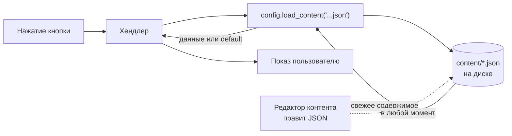

# Лекция 2. Конфигурация и контент

**Цель:** разобрать, как бот отделяет *настройки* и *наполнение* от кода. Это
техническая основа принципа «код vs контент» из лекции 0. Прочитаем `config.py`
целиком и поймём, почему контент читается заново на каждый запрос.

**Нужно заранее:** [Лекция 1](01-aiogram-basics.md). Полезно знать, что такое
переменные окружения.

---

## 1. Зачем вообще выносить настройки из кода

Три причины, и все три — практические:

1. **Секреты не должны лежать в коде.** Токен бота — это пароль: кто им владеет,
   управляет ботом. В репозиторий его класть нельзя. Поэтому он живёт в `.env`,
   который добавлен в `.gitignore` и в git не попадает.
2. **Одна кодовая база — разные окружения.** На вашем ноутбуке один тестовый бот и
   канал, на сервере — боевой. Код одинаковый, отличаются только значения в `.env`.
3. **Настройки меняет не программист.** Поменять плейлист или список админов должен
   уметь владелец канала, не трогая Python.

Отсюда разделение: **`.env`** — короткие технические настройки (токен, id канала,
ссылки, id админов); **`content/*.json`** — объёмное наполнение (факты, тесты,
квест). И то и другое — снаружи кода.

---

## 2. `.env` и python-dotenv

`.env` — простой текстовый файл `КЛЮЧ=значение`. Вот фрагмент `.env.example`
(шаблон, который копируют в настоящий `.env`):

```bash
BOT_TOKEN=
CHANNEL_ID=@blackmagicwoman
CHANNEL_URL=https://t.me/blackmagicwoman
COMMUNITY_CHAT_URL=
YANDEX_PLAYLIST_URL=
ADMIN_IDS=
RESET_FACTS_WHEN_DONE=false
MENU_IMAGE=
```

Библиотека **python-dotenv** подгружает эти пары в переменные окружения процесса.
В `config.py` это одна строка в самом верху модуля:

```python
from dotenv import load_dotenv

BASE_DIR = Path(__file__).resolve().parent
CONTENT_DIR = BASE_DIR / "content"

load_dotenv(BASE_DIR / ".env")
```

Тонкость, которую легко пропустить: путь к `.env` строится **от файла**, а не от
текущей рабочей директории. `Path(__file__).resolve().parent` — это папка, где
лежит `config.py` (корень проекта). Благодаря этому бот найдёт `.env` и
`content/`, **из какой бы директории его ни запустили** (`python main.py`,
`python /path/to/main.py`, из systemd-юнита…). Привязываться к `os.getcwd()` —
классический источник «у меня работает, на сервере не находит файл».

После `load_dotenv` значения достаются стандартным `os.getenv`:

```python
BOT_TOKEN = os.getenv("BOT_TOKEN", "").strip()
```

`.strip()` — защита от пробела или перевода строки, случайно попавшего в `.env`
при копировании. Мелочь, которая экономит час отладки «токен же правильный, почему
не работает».

---

## 3. Парсеры: из строки в нужный тип

`os.getenv` всегда возвращает **строку** (или `None`). А коду нужны разные типы:
id канала бывает числом, список админов — это множество чисел, флаг — булево.
Поэтому в `config.py` три маленькие чистые функции-парсера. Разберём каждую — это
хороший пример «оборонительного» разбора пользовательского ввода.

### 3.1. `_parse_channel_id` — строка или число

```python
def _parse_channel_id(raw: str):
    """CHANNEL_ID поддерживает два формата: '@username' и числовой '-100...'."""
    raw = (raw or "").strip()
    if raw.lstrip("-").isdigit():
        return int(raw)
    return raw
```

Telegram принимает идентификатор чата в двух видах: публичный `@username` (строка)
или внутренний числовой `chat_id` вида `-1001234567890`. Приватные каналы
`@username` не имеют — для них только число. Функция различает их так:
`raw.lstrip("-")` срезает ведущий минус (у числовых id он есть), и если остаток —
цифры, это число, иначе — `@username`.

`(raw or "")` — приём «None → пустая строка»: если переменной нет, `os.getenv`
вернёт `None`, и `.strip()` на `None` упал бы. Здесь же `None` тихо превращается в
`""`.

### 3.2. `_parse_admin_ids` — список в множество

```python
def _parse_admin_ids(raw: str) -> set[int]:
    """ADMIN_IDS — список id через запятую -> множество чисел."""
    ids = set()
    for part in (raw or "").split(","):
        part = part.strip()
        if part.isdigit():
            ids.add(int(part))
    return ids
```

`ADMIN_IDS=12345678,87654321` превращается в `{12345678, 87654321}`. Два решения
здесь осмысленны:

- **Множество, а не список.** Дальше будет проверка `user.id in config.ADMIN_IDS` —
  и в middleware, и в `/stats`. По множеству проверка вхождения — O(1), а ещё
  множество само убирает дубликаты.
- **`if part.isdigit()`** молча отбрасывает мусор (лишние запятые, пробелы,
  опечатки). Бот не должен падать на старте из-за кривой строки в `.env`.

### 3.3. `_parse_bool` — человеко-понятное «да»

```python
def _parse_bool(raw: str, default: bool = False) -> bool:
    if raw is None:
        return default
    return raw.strip().lower() in {"1", "true", "yes", "on", "да"}
```

Никакого `bool(os.getenv(...))` — это была бы ловушка: непустая строка `"false"`
сама по себе истинна (`bool("false") == True`). Поэтому булево разбирается явно по
списку «истинных» слов, включая русское «да». Всё прочее — `False`.

**Общий вывод по парсерам:** настройки приходят от человека, человек ошибается.
Каждый парсер либо корректно интерпретирует значение, либо мягко откатывается к
безопасному дефолту — но не роняет процесс. Это та же философия устойчивости, что
и в работе с контентом ниже.

---

## 4. Переменные конфига

После парсеров идёт собственно «таблица настроек» — плоский список модульных
констант:

```python
BOT_TOKEN = os.getenv("BOT_TOKEN", "").strip()
CHANNEL_ID = _parse_channel_id(os.getenv("CHANNEL_ID", ""))
CHANNEL_URL = os.getenv("CHANNEL_URL", "").strip()
COMMUNITY_CHAT_URL = os.getenv("COMMUNITY_CHAT_URL", "").strip()
YANDEX_PLAYLIST_URL = os.getenv("YANDEX_PLAYLIST_URL", "").strip()
ADMIN_IDS = _parse_admin_ids(os.getenv("ADMIN_IDS", ""))
RESET_FACTS_WHEN_DONE = _parse_bool(os.getenv("RESET_FACTS_WHEN_DONE"), False)
MENU_IMAGE = os.getenv("MENU_IMAGE", "").strip()

DB_PATH = os.getenv("DB_PATH", str(BASE_DIR / "bot.db"))
LOG_FILE = os.getenv("LOG_FILE", str(BASE_DIR / "bot.log"))
```

Здесь стоит присвоить **паттерн «config как модуль»**. `config.py` импортируется, и
все настройки доступны как `config.BOT_TOKEN`, `config.ADMIN_IDS` и т.д. Простой,
прозрачный приём: единый источник правды по настройкам, никаких «прокидываний»
параметров через полпроекта. Любой модуль делает `import config` и берёт нужное.

Заметьте, что `DB_PATH` и `LOG_FILE` тоже можно переопределить через `.env`, но у
них есть рабочие дефолты рядом с проектом. Гибкость без обязательной возни.

---

## 5. `validate()` — падать рано и понятно

```python
def validate() -> None:
    """Проверяет обязательные переменные. Вызывается один раз при старте."""
    if not BOT_TOKEN:
        raise RuntimeError(
            "Не задан BOT_TOKEN. Скопируй .env.example в .env и впиши токен "
            "бота от @BotFather."
        )
    if not CHANNEL_ID:
        raise RuntimeError(
            "Не задан CHANNEL_ID. Укажи @username канала или числовой id (-100...) в .env."
        )
```

Вызывается из `main()` сразу после логирования (лекция 1). Идея — **fail fast**:
если обязательная настройка не задана, бот должен упасть немедленно и с
инструкцией, что делать, а не запуститься и загадочно не работать.

Сравните два сценария отсутствия токена:

- *Без `validate`:* бот стартует, идёт в Telegram, получает `401 Unauthorized`
  где-то в недрах polling — и вы гадаете, в чём дело.
- *С `validate`:* на старте видите «Не задан BOT_TOKEN. Скопируй .env.example…».
  Сразу ясно и что не так, и как починить.

Хорошее правило: проверяйте предусловия как можно раньше и давайте сообщение об
ошибке, адресованное тому, кто будет это чинить.

---

## 6. Загрузка контента: `load_content`

Теперь второй пласт — наполнение. Весь контент лежит в `content/*.json`, а читает
его одна функция:

```python
def load_content(name: str, default=None):
    """Читает JSON из папки content/. При ошибке логирует и возвращает default."""
    path = CONTENT_DIR / name
    try:
        with open(path, encoding="utf-8") as f:
            return json.load(f)
    except FileNotFoundError:
        logger.warning("Файл контента отсутствует: %s", path)
    except json.JSONDecodeError as e:
        logger.error("Ошибка разбора JSON в %s: %s", path, e)
    return default
```

Функция маленькая, но в ней три важных решения.

**(1) Никогда не бросает наружу.** Два самых вероятных сбоя — файла нет
(`FileNotFoundError`) и в нём кривой JSON (`json.JSONDecodeError`) — перехвачены,
залогированы и приводят к возврату `default`. Хендлер, который вызвал
`load_content("events.json", default=[])`, получит пустой список и покажет
заглушку «мероприятий пока нет» вместо падения. Это и есть та самая устойчивость к
плохому контенту, которую требует архитектура «контент снаружи».

**(2) Разные уровни логирования.** Отсутствие файла — `warning` (это нормально:
часть контента можно добавить позже, например `events.json` появится потом).
Битый JSON — `error` (это уже ошибка редактора контента, её надо чинить). Разделять
«ожидаемое отсутствие» и «настоящую поломку» по уровню логов — правильная привычка.

**(3) `encoding="utf-8"`.** Контент на русском. Без явной кодировки на части систем
получите кракозябры или `UnicodeDecodeError`.

---

## 7. Почему файл читается на каждый запрос

Это самое неочевидное и самое важное решение. `load_content` **не кэширует** — она
открывает и парсит файл *каждый раз*, когда хендлер хочет показать факт, вопрос или
узел квеста. Посмотрите, например, как это вызывается в `facts.py`:

```python
@router.callback_query(F.data == "menu_fact")
async def show_fact(callback: CallbackQuery) -> None:
    ...
    facts = config.load_content("facts.json", default=[])
    ...
```

Каждое нажатие «Рандомный факт» → новое чтение `facts.json` с диска.

**Зачем так, ведь это лишние операции ввода-вывода?** Ради главного свойства
проекта: **правки контента подхватываются без перезапуска бота.** Владелец канала
открыл `facts.json`, дописал факт, сохранил — следующий пользователь уже видит
новый факт. Не нужно перезапускать процесс, не нужен программист.

Это сознательный размен: мы платим копеечным чтением небольшого JSON, а получаем
живой контент, редактируемый на ходу. Для бота такого масштаба файлы крошечные, а
SQLite/ОС всё равно кэшируют их в памяти — реальная цена близка к нулю. Если бы
файлы были огромными или запросов были тысячи в секунду, выбор мог бы быть иным
(кэш с инвалидацией по mtime), но здесь простота важнее.



---

## 8. Контентные файлы проекта

Чтобы видеть всю картину, вот какие файлы читает `load_content` и кто их потребляет
(детали структуры — в соответствующих лекциях):

| Файл | Кто читает | Структура (кратко) |
|------|-----------|--------------------|
| `facts.json` | `handlers/facts.py` | список `{"id": int, "text": str}` — у каждого факта уникальный `id` (лекция 6) |
| `quiz_zodiac.json` | `handlers/tests.py` | словарь `{"Овен": {"name", "desc"}, …}` на 12 знаков (лекция 3) |
| `quiz_style.json` | `handlers/tests.py` | `{"title", "questions": [...], "results": {...}}` — вопросы с очками (лекция 7) |
| `quest_concert.json` | `handlers/tests.py` | `{"start", "nodes": {...}}` — граф квеста (лекция 8) |
| `events.json` | `handlers/events.py` | список `{"title","date","place","url"}` (может отсутствовать) |
| `menu.png` / `menu.jpg` | `handlers/menu.py` | картинка-баннер меню (не JSON, лекция 9) |

Все JSON — в кодировке UTF-8. Идентификаторы и `id` стоит держать стабильными: по
`facts.json[].id` база помнит, какие факты пользователь уже видел, а по id узлов
квеста строятся `callback_data` (а там лимит 64 байта, лекция 4).

---

### Итоги лекции

- Настройки и секреты — в `.env` (через python-dotenv), наполнение — в
  `content/*.json`. И то и другое снаружи кода.
- Путь к `.env`/`content` строится от файла (`Path(__file__).parent`), а не от
  cwd — бот находит свои файлы откуда угодно.
- Парсеры (`_parse_channel_id`, `_parse_admin_ids`, `_parse_bool`) превращают
  строки в нужные типы и мягко переживают мусор; `ADMIN_IDS` — множество ради
  быстрой проверки вхождения.
- `validate()` реализует fail-fast: нет токена/канала — падаем сразу с инструкцией.
- `load_content` никогда не бросает наружу (файл/JSON — в `default`) и **читает
  заново каждый раз**, обеспечивая горячую правку контента ценой копеечного I/O.

**Дальше:** [Лекция 3. Роутеры, хендлеры, фильтры →](03-routers-handlers-filters.md)
