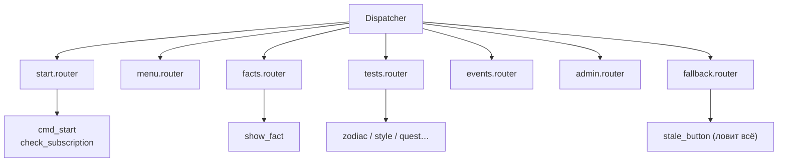
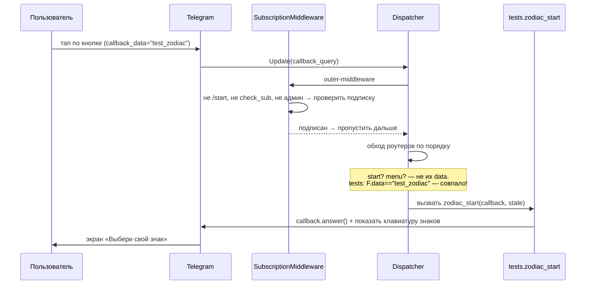

# Лекция 3. Роутеры, хендлеры, фильтры

**Цель:** понять, как апдейт находит свой обработчик. Разберём `Router`, порядок
включения роутеров (это не косметика, а логика), типы хендлеров (`message` против
`callback_query`) и систему фильтров, включая «магический» `F`.

**Нужно заранее:** [Лекция 1](01-aiogram-basics.md) (что такое апдейт, `Dispatcher`).

---

## 1. Хендлер — это просто функция

Хендлер в aiogram 3 — обычная `async`-функция, помеченная декоратором роутера.
Минимальный пример прямо из проекта (`handlers/admin.py`):

```python
from aiogram import Router
from aiogram.filters import Command
from aiogram.types import Message

router = Router()

@router.message(Command("stats"))
async def cmd_stats(message: Message) -> None:
    ...
```

Читается как предложение: «у этого роутера: на **сообщение**, удовлетворяющее
фильтру **команда `stats`**, вызови функцию `cmd_stats`». Декоратор регистрирует
функцию в роутере; сам по себе хендлер вы никогда не вызываете — его вызывает
диспетчер, когда придёт подходящий апдейт.

Аргумент `message: Message` aiogram подставляет сам. Это часть механизма
**инъекции зависимостей**: фреймворк смотрит на имена и аннотации параметров
хендлера и передаёт нужные объекты. Поэтому в разных хендлерах проекта вы увидите
разные сигнатуры — `(message: Message)`, `(callback: CallbackQuery)`,
`(callback: CallbackQuery, state: FSMContext)` — aiogram даёт ровно то, что
объявлено (про `state` — лекция 7).

---

## 2. Router: группировка и композиция

`Router` — контейнер для связанных хендлеров. В проекте **один роутер на файл-тему**:

```python
# в каждом из handlers/*.py
router = Router()
```

`start.router`, `menu.router`, `facts.router` и т.д. Затем все они подключаются к
диспетчеру в `main.py`:

```python
dp.include_router(start.router)
dp.include_router(menu.router)
dp.include_router(facts.router)
dp.include_router(tests.router)
dp.include_router(events.router)
dp.include_router(admin.router)
dp.include_router(fallback.router)
```

Зачем дробить на роутеры, если можно всё повесить на один диспетчер? Ради
**модульности**. Каждая тема (факты, тесты, мероприятия) живёт в своём файле со
своим роутером и не знает о других. Добавить раздел = создать файл с роутером и
одной строкой подключить его. Удалить = убрать строку. Диспетчер просто
объединяет роутеры в общую цепочку.



---

## 3. Порядок включения = приоритет

Вот ключевая идея лекции. Когда приходит апдейт, диспетчер обходит роутеры **в том
порядке, в котором они включены**, и в каждом — хендлеры в порядке объявления. Как
только нашёлся хендлер, чьи фильтры прошли, — он вызывается, и **обход
прекращается**. Остальные роутеры этот апдейт уже не увидят.

Это значит: `include_router` — это назначение приоритета. Порядок в `main.py`
выбран осознанно. Два места, где это критично:

### 3.1. `start` — первым

```python
# start (/start и check_sub) включаем первым.
dp.include_router(start.router)
```

`start.router` обрабатывает `/start` и кнопку «Я подписался» (`check_sub`). Эти
события — единственная легальная точка входа для **неподписанного** пользователя,
и middleware специально их пропускает (лекция 5). Логично, чтобы роутер входа
проверялся раньше всех.

### 3.2. `fallback` — строго последним

```python
# Фолбэк для устаревших кнопок — строго последним, чтобы не перехватывать
# настоящие callback'и (роутеры проверяются по порядку включения).
dp.include_router(fallback.router)
```

А вот это — учебный случай, почему порядок важен. Загляните в `fallback.py`:

```python
@router.callback_query()          # без фильтра — ловит ЛЮБОЙ callback
async def stale_button(callback: CallbackQuery) -> None:
    await callback.answer("Кнопка устарела — открой раздел заново 🤘", show_alert=False)
```

`@router.callback_query()` **без фильтра** означает «любое нажатие любой кнопки».
Если бы `fallback` стоял первым, он перехватывал бы **все** коллбэки — меню, факты,
тесты перестали бы работать. Поставленный последним, он получает только то, что не
поймал никто выше: например, нажатие на кнопку из старого сообщения, когда тест уже
завершён и состояние сброшено (подробно — лекция 9).

Запомните общее правило: **специфичные хендлеры — раньше, всеохватные —
позже.** Catch-all всегда последним.

---

## 4. Два типа хендлеров: `message` и `callback_query`

Проект реагирует на два вида апдейтов, и под каждый — свой декоратор.

### 4.1. `@router.message(...)` — входящие сообщения

Срабатывает, когда пользователь *прислал сообщение*. В проекте таких немного — это
команды:

```python
# handlers/start.py
@router.message(CommandStart())
async def cmd_start(message: Message) -> None: ...

# handlers/admin.py
@router.message(Command("stats"))
async def cmd_stats(message: Message) -> None: ...
```

Объект `Message` несёт всё про сообщение: `message.text`, `message.from_user`,
`message.chat`, а также методы-ответы `message.answer(...)`,
`message.answer_photo(...)`.

### 4.2. `@router.callback_query(...)` — нажатия inline-кнопок

Срабатывает, когда пользователь *нажал inline-кнопку*. Это основной тип в боте —
всё меню и все разделы построены на кнопках:

```python
# handlers/menu.py
@router.callback_query(F.data == "menu_playlist")
async def show_playlist(callback: CallbackQuery) -> None: ...
```

Объект `CallbackQuery` устроен иначе, и эти отличия надо усвоить:

- `callback.data` — строка `callback_data` нажатой кнопки (та, что заложена в
  клавиатуре, лекция 4). Именно по ней фильтруют.
- `callback.from_user` — кто нажал.
- `callback.message` — сообщение, **под которым** висит кнопка. Через него
  редактируют экран: `callback.message.edit_text(...)`. Тонкость: это сообщение
  отправлено *ботом*, поэтому `callback.message.from_user` — это бот, а не человек.
  Чтобы узнать, кто нажал, берут `callback.from_user`.
- `callback.answer(...)` — **обязательный** ответ Telegram, что нажатие принято.
  Без него на кнопке крутится «часик» до таймаута. Можно показать всплывающее
  уведомление: `callback.answer("текст", show_alert=True)`. Почему это важно —
  лекция 9.

---

## 5. Фильтры: как хендлер понимает «это моё»

Фильтр — условие, которое апдейт должен пройти, чтобы хендлер сработал. В проекте
встречаются три семейства.

### 5.1. Встроенные фильтры команд

```python
from aiogram.filters import CommandStart, Command

@router.message(CommandStart())     # ловит /start (и /start с параметром)
@router.message(Command("stats"))   # ловит /stats
```

`CommandStart()` — специальный фильтр под `/start` (умеет и deep-link параметры
вида `/start abc`). `Command("stats")` — под произвольную команду. Использовать их
вместо ручного `if message.text == "/stats"` правильно: они корректно учитывают
формат команд Telegram (например, `/stats@MyBot` в группах).

### 5.2. Магический фильтр `F`

```python
from aiogram import F

@router.callback_query(F.data == "menu_fact")
@router.callback_query(F.data.startswith("zodiac:"))
@router.callback_query(F.data == "check_sub")
```

`F` (от *MagicFilter*) — выразительный способ описать условие на поля объекта.
`F.data` ссылается на атрибут `.data` входящего `CallbackQuery`, а дальше
строится условие:

- `F.data == "menu_fact"` — точное совпадение строки коллбэка.
- `F.data.startswith("zodiac:")` — префиксный матч. Так ловят **семейство**
  кнопок: `zodiac:0`, `zodiac:1`, …, `zodiac:11` — все попадают в один хендлер,
  который потом разбирает индекс из `callback.data` (лекция 4).

`F` ленив: `F.data == "x"` создаёт не значение, а **объект-предикат**, который
aiogram применит к апдейту. Можно комбинировать (`&`, `|`, `~`), обращаться к
вложенным полям (`F.from_user.id`), но в этом проекте используются простые формы —
и для большинства ботов их хватает.

### 5.3. Фильтр по состоянию FSM

```python
@router.callback_query(StyleTest.answering, F.data.startswith("style_ans:"))
async def style_answer(...): ...
```

Первым позиционным аргументом можно передать **состояние FSM** — тогда хендлер
сработает, только если пользователь сейчас в этом состоянии. Это разбираем целиком
в лекции 7; пока зафиксируйте: фильтры комбинируются, и «состояние» — один из них.

---

## 6. Как складываются несколько фильтров

Когда в декораторе несколько фильтров через запятую — это логическое **И**: должны
пройти все. В примере выше хендлер `style_answer` сработает, только если
*одновременно* пользователь в состоянии `StyleTest.answering` **и** `callback.data`
начинается с `style_ans:`.

Если нужно **ИЛИ** в одном условии — используют оператор `|` внутри `F`
(`F.data == "a" | F.data == "b"`) либо просто пишут два хендлера. В проекте чаще
второй путь: он читается яснее.

---

## 7. Пример сквозного прохода: нажали «Музыкант по знаку зодиака»

Соберём всё вместе на одном реальном маршруте. Пользователь в меню тестов нажал
кнопку «♈ Музыкант по знаку зодиака» (её `callback_data == "test_zodiac"`).



Каждый слой делает свою работу: middleware пропустил (подписан), диспетчер по
`F.data == "test_zodiac"` нашёл хендлер в `tests.router`, хендлер ответил. Если бы
ни один фильтр не совпал, апдейт «провалился» бы в `fallback` и получил «кнопка
устарела».

---

## 8. Частые грабли

- **`fallback` не последним.** Catch-all `@router.callback_query()` где-нибудь в
  середине перехватит весь интерактив. Только в самом конце.
- **Забыли `callback.answer()`.** Кнопка «думает» до таймаута. В проекте `answer()`
  есть в каждом callback-хендлере — иногда первым же действием.
- **Сравнение `callback.data` вручную в одном большом хендлере.** Тянет к
  «простыне» `if/elif`. aiogram-путь — отдельные хендлеры с фильтрами `F.data`,
  это и есть маршрутизация. В проекте так и сделано.
- **Путаница `callback.from_user` и `callback.message.from_user`.** Первый — кто
  нажал; второй — отправитель сообщения (бот). Для прав и записи в БД нужен первый.

---

### Итоги лекции

- Хендлер — `async`-функция с декоратором роутера; aiogram сам подставляет
  аргументы по аннотациям (DI).
- `Router` группирует хендлеры по теме (файл = роутер), `include_router`
  собирает их в цепочку.
- **Порядок включения роутеров = приоритет.** `start` — первым, `fallback`
  (catch-all) — строго последним.
- `message` и `callback_query` — два типа хендлеров; у `CallbackQuery` ключевые
  `.data`, `.from_user`, `.message` и обязательный `.answer()`.
- Фильтры: `CommandStart()/Command()` для команд, магический `F` для условий на
  поля (`==`, `startswith`), состояние FSM как ещё один фильтр; несколько фильтров
  через запятую — это И.

**Дальше:** [Лекция 4. Клавиатуры и callback_data →](04-keyboards-callback-data.md)
