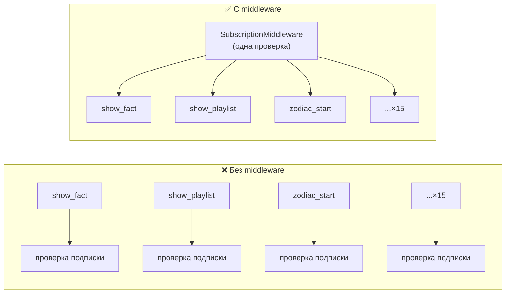
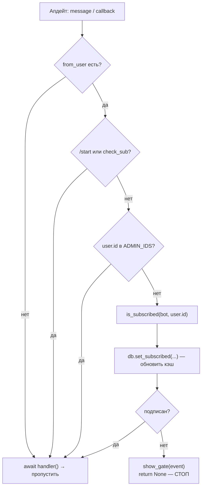
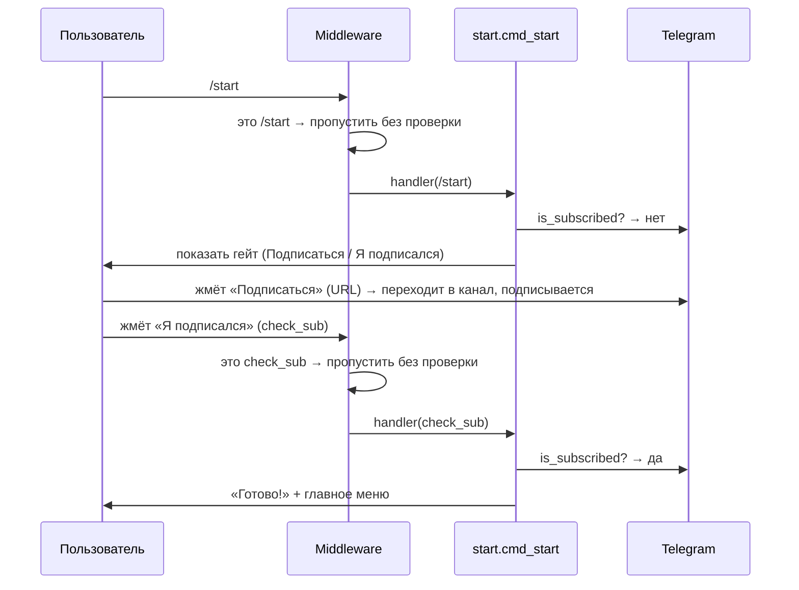

# Лекция 5. Middleware и гейт подписки

**Цель:** разобрать middleware как механизм сквозной логики и на его примере —
центральную бизнес-фичу бота: гейт подписки. Это «вахтёр» из диаграммы лекции 0,
который проверяет подписку перед **любым** действием.

**Нужно заранее:** [Лекция 1](01-aiogram-basics.md) (Dispatcher, апдейты),
[Лекция 3](03-routers-handlers-filters.md) (роутеры, порядок), полезна
[Лекция 0](00-architecture-overview.md).

---

## 1. Что такое middleware и зачем оно

Middleware — это «прослойка», через которую проходит апдейт **по пути к хендлеру**.
Она может: посмотреть на апдейт, что-то сделать до хендлера, решить —
пропускать дальше или нет, что-то сделать после.

Когда оно нужно? Когда логика **сквозная** — должна применяться ко *всем* (или
многим) апдейтам, и дублировать её в каждом хендлере было бы глупо. Классика:
аутентификация, логирование, троттлинг, подстановка зависимостей. У нас —
**проверка подписки**.

Сформулируем требование: «перед любым действием, кроме входа и админских команд,
убедись, что пользователь подписан на канал; если нет — покажи гейт и не пускай
дальше». Можно было бы в начало каждого хендлера (а их полтора десятка) вставить
проверку. Но это дублирование, которое рано или поздно забудут обновить в одном
месте. Middleware решает это **в одной точке** для всех хендлеров сразу.



---

## 2. outer vs inner middleware

В aiogram middleware бывает двух уровней, и разница принципиальна:

- **outer-middleware** срабатывает **до фильтров** — на *каждый* апдейт данного
  типа, ещё до того, как aiogram начал решать, какому хендлеру он достанется.
- **inner-middleware** срабатывает **после фильтров** — только когда уже известно,
  что есть подходящий хендлер.

Для гейта нужен именно **outer**: мы хотим перехватывать вообще всё, в том числе
случаи, когда подходящего хендлера и нет. Поэтому в `main.py`:

```python
gate = SubscriptionMiddleware()
dp.message.outer_middleware(gate)
dp.callback_query.outer_middleware(gate)
```

Один экземпляр middleware вешается на **два потока** апдейтов — сообщения и нажатия
кнопок. Это ровно те типы, через которые пользователь вообще может что-то сделать.
Регистрация на `dp.message`/`dp.callback_query` (а не на конкретный роутер) означает
«глобально, до всех роутеров».

---

## 3. Контракт middleware: метод `__call__`

Middleware в aiogram 3 — это класс-наследник `BaseMiddleware` с одним методом:

```python
class SubscriptionMiddleware(BaseMiddleware):
    async def __call__(
        self,
        handler: Callable[[TelegramObject, dict[str, Any]], Awaitable[Any]],
        event: TelegramObject,
        data: dict[str, Any],
    ) -> Any:
        ...
```

Три параметра — это и есть весь контракт:

- **`handler`** — «следующее звено цепочки»: собственно вызов хендлера (или
  следующей middleware). Ключевой момент: **апдейт пойдёт дальше, только если вы
  сами вызовете `await handler(event, data)`.** Не вызвали — апдейт остановлен здесь.
- **`event`** — сам апдейт (`Message` или `CallbackQuery` в нашем случае).
- **`data`** — изменяемый словарь контекста, который aiogram прокидывает в хендлер.
  Сюда можно класть зависимости; отсюда же берут уже готовые. Например,
  `bot = data["bot"]` — экземпляр бота лежит в контексте.

Эта структура и даёт middleware силу: она **оборачивает** вызов хендлера. Что
угодно до `await handler(...)` — выполнится перед хендлером; решение «не вызывать»
— блокирует; что угодно после — выполнится на обратном пути.

---

## 4. Логика гейта по шагам

Теперь сам метод. Это последовательность «привратника»: серия исключений, кого
пропустить без проверки, и только в конце — собственно проверка. Идём по порядку
кода.

```python
bot = data["bot"]
user = event.from_user
if user is None:
    return await handler(event, data)
```

Берём бота из контекста и пользователя из апдейта. `from_user is None` — крайне
редкий случай (системные апдейты без автора); такое просто пропускаем — гейт к ним
неприменим.

```python
# /start и check_sub сами разбираются с гейтом — пропускаем их.
if isinstance(event, Message) and event.text and event.text.startswith("/start"):
    return await handler(event, data)
if isinstance(event, CallbackQuery) and event.data == "check_sub":
    return await handler(event, data)
```

**Исключение №1 — точки входа.** `/start` и кнопка «Я подписался» (`check_sub`)
обязаны работать для *неподписанного* пользователя — иначе он не сможет ни начать,
ни перепроверить подписку. Если бы гейт их блокировал, человек попал бы в тупик:
чтобы пройти гейт, надо нажать «Я подписался», но гейт не пускает нажатие. Поэтому
эти два события пропускаются без проверки — они сами показывают гейт (лекция, ниже).
Именно ради этого `start.router` включён первым (лекция 3).

```python
# Админов не запираем, иначе они не смогут вызвать /stats.
if user.id in config.ADMIN_IDS:
    return await handler(event, data)
```

**Исключение №2 — админы.** Админ может быть не подписан на собственный канал, но
`/stats` ему нужен. Проверка `user.id in config.ADMIN_IDS` — то самое быстрое
вхождение в множество, ради которого `ADMIN_IDS` распарсили в `set` (лекция 2).

```python
# Основная проверка подписки.
subscribed = await is_subscribed(bot, user.id)
await db.set_subscribed(user.id, subscribed)
if subscribed:
    return await handler(event, data)

# Не подписан — показываем гейт и дальше не пускаем.
await show_gate(event)
return None
```

**Основной путь.** Спрашиваем Telegram, подписан ли пользователь (см. ниже),
обновляем флаг в БД (для статистики), и:

- подписан → `await handler(event, data)` — пропускаем к хендлеру;
- не подписан → `show_gate(event)` и `return None` — **хендлер не вызывается**.

Вот оно, ключевое свойство: при отказе мы просто **не вызываем `handler`**. Апдейт
умирает в middleware, ни один хендлер о нём не узнает.



---

## 5. Как именно проверяется подписка

Подписка не хранится в боте как истина — она **спрашивается у Telegram в реальном
времени** методом `get_chat_member`:

```python
_SUBSCRIBED_STATUSES = {
    ChatMemberStatus.CREATOR,
    ChatMemberStatus.ADMINISTRATOR,
    ChatMemberStatus.MEMBER,
}

async def is_subscribed(bot, user_id: int) -> bool:
    try:
        member = await bot.get_chat_member(config.CHANNEL_ID, user_id)
        return member.status in _SUBSCRIBED_STATUSES
    except (TelegramBadRequest, TelegramForbiddenError) as e:
        logger.warning("Не удалось проверить подписку user_id=%s: %s", user_id, e)
        return False
```

Разберём по частям.

**Статусы.** `get_chat_member` возвращает статус пользователя в канале. «Подписан»
— это `CREATOR` (создатель), `ADMINISTRATOR` (админ) или `MEMBER` (обычный
участник). Их собрали в множество `_SUBSCRIBED_STATUSES`. Прочие статусы —
`LEFT` (вышел), `KICKED` (забанен), `RESTRICTED` — считаются «не подписан».
Использовать перечисление `ChatMemberStatus`, а не строки, — правильно: меньше
шансов на опечатку и яснее намерение.

**Почему именно реальное время.** Между двумя нажатиями человек мог отписаться. БД
об этом не знает, а Telegram знает. Поэтому источник правды — всегда живой запрос
`get_chat_member`, а колонка `is_subscribed` в БД — лишь кэш для `/stats` (лекция
6). Это важное архитектурное различие: *истина снаружи, в БД — снимок*.

**Обработка ошибок.** Вызов обёрнут в `try/except`, и при `TelegramBadRequest` /
`TelegramForbiddenError` функция **логирует и возвращает `False`** (трактует как
«не подписан»). Самая частая причина такой ошибки — **бот не админ канала**: без
прав администратора `get_chat_member` запрещён, и проверка падает. В этом случае
гейт закрывается для всех — поэтому в README отдельным пунктом: «сделай бота
админом канала, иначе функционал закрыт». Выбор «при ошибке считать не подписанным»
— безопасный по умолчанию (fail closed): лучше лишний раз показать гейт, чем по
ошибке пустить внутрь.

---

## 6. Экран гейта: разница message и callback

Гейт показывает функция `show_gate`, и она аккуратно различает, *откуда* пришёл
пользователь:

```python
async def show_gate(event: Message | CallbackQuery) -> None:
    kb = gate_kb(config.CHANNEL_URL)
    if isinstance(event, CallbackQuery):
        await event.answer(ALERT_NOT_SUBSCRIBED, show_alert=True)
        try:
            await event.message.edit_text(GATE_TEXT, reply_markup=kb)
        except TelegramBadRequest:
            await event.message.answer(GATE_TEXT, reply_markup=kb)
    else:
        await event.answer(GATE_TEXT, reply_markup=kb)
```

- **Если это сообщение** (`/start` от неподписанного) — просто отправляем новый
  экран гейта: `event.answer(GATE_TEXT, ...)`.
- **Если это нажатие кнопки** (`check_sub`, а подписки нет) — сначала
  `event.answer(ALERT_NOT_SUBSCRIBED, show_alert=True)` показывает **всплывающее
  уведомление** «ты ещё не подписан», а потом пытаемся **отредактировать** текущее
  сообщение в гейт. Редактирование (`edit_text`) обёрнуто в `try/except
  TelegramBadRequest`: если отредактировать нельзя (например, сообщение было с
  фото — его нельзя превратить в текст, лекция 9), откатываемся к отправке нового
  (`event.message.answer`).

Это первый пример приёма «правка с откатом на отправку», который в проекте
встречается постоянно (его обобщение — `safe_edit`, лекция 9). И `show_alert=True`
показывает, как `callback.answer` умеет не просто гасить «часик», а выдавать
модальное уведомление.

---

## 7. Полный цикл прохождения гейта

Соберём поведение целиком — путь нового пользователя:



Заметьте: и `/start`, и `check_sub` middleware **пропускает без проверки**, но
проверку всё равно делает уже сам хендлер `start.py` (`is_subscribed` внутри
`cmd_start`/`check_subscription`). Разделение ответственности: middleware решает
«пускать ли в общие разделы», а вход сам разбирается со своей логикой подписки.
После успеха `check_subscription` зовёт `show_main_menu` — и пользователь внутри.

---

## 8. Частые грабли

- **Забыть `await handler(event, data)`.** Тогда middleware «съедает» апдейт, и
  бот вообще ничего не делает. Пропуск дальше — обязанность middleware.
- **Не исключить точки входа.** Если гейт блокирует `/start` и `check_sub`,
  пользователь попадает в тупик «не могу подписаться, потому что не подписан».
- **Бот не админ канала.** `get_chat_member` падает, `is_subscribed` всегда
  `False`, гейт закрыт для всех. Это не баг кода, а настройка прав.
- **Считать БД источником правды о подписке.** Человек отписался — БД устарела.
  Истину спрашивают у Telegram каждый раз.
- **inner вместо outer.** Inner-middleware не сработает там, где нет подходящего
  хендлера, и часть апдейтов пройдёт мимо гейта. Для глобального вахтёра нужен
  outer.

---

### Итоги лекции

- Middleware — место для сквозной логики; гейт подписки реализован как **одна**
  outer-middleware на `message` и `callback_query` вместо проверок в каждом
  хендлере.
- Контракт — `async __call__(handler, event, data)`; апдейт идёт дальше, только
  если вызвать `await handler(event, data)`; иначе он остановлен.
- Гейт — это серия исключений (точки входа `/start`/`check_sub`, админы) и затем
  проверка `is_subscribed`.
- Подписка проверяется у Telegram в реальном времени (`get_chat_member`), статусы
  `CREATOR/ADMINISTRATOR/MEMBER`; БД хранит лишь кэш-флаг. При ошибке — fail closed
  (считаем «не подписан»), частая причина — бот не админ канала.
- `show_gate` различает message/callback и впервые показывает приём «edit с откатом
  на answer».

**Дальше:** [Лекция 6. База данных: aiosqlite и SQLite →](06-database-aiosqlite.md)
