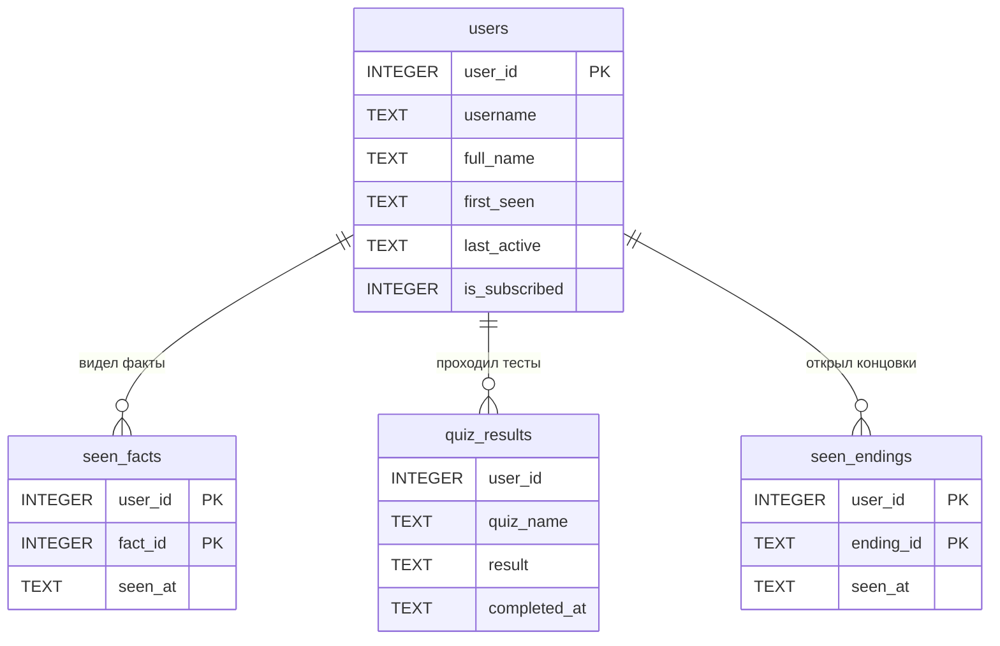
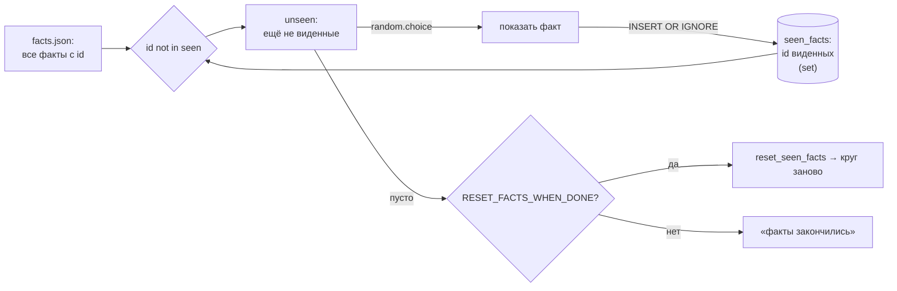

# Лекция 6. База данных: aiosqlite и SQLite

**Цель:** разобрать слой данных — почему SQLite, почему одно соединение на весь
процесс, как устроены таблицы и какие SQL-приёмы (`UPSERT`, `INSERT OR IGNORE`)
делают записи идемпотентными. Построим ER-модель и пройдём по каждому запросу
`database/db.py`.

**Нужно заранее:** [Лекция 1](01-aiogram-basics.md) (`async`, жизненный цикл),
базовое знание SQL (SELECT/INSERT/UPDATE).

---

## 1. Почему SQLite (а не PostgreSQL и не «просто файл»)

Слою данных бота нужно немного: помнить пользователей, какие факты кто видел,
результаты тестов, открытые концовки квеста. Объёмы — небольшие, нагрузка —
человеческая (нажатия кнопок). Для этого SQLite идеален:

- **Нулевая инфраструктура.** Это файл `bot.db` рядом с кодом. Не надо поднимать
  сервер БД, заводить пользователей, настраивать сеть. Скопировал файл — перенёс
  базу.
- **Транзакционность и SQL.** В отличие от «сохраню в JSON», у нас полноценный SQL:
  индексы, ограничения целостности, `COUNT`, `DATE()`. И ACID — данные не побьются
  на полузаписи.
- **Достаточно быстро.** Для одного канального бота производительности SQLite с
  огромным запасом.

Когда бы выбор был другим? Если бы понадобилось несколько процессов, пишущих
одновременно, или сотни запросов в секунду, или репликация — тогда PostgreSQL. Здесь
этого нет, и тянуть тяжёлую БД было бы переинженерингом.

**`aiosqlite`** — асинхронная обёртка над стандартным `sqlite3`. Зачем async? Сам
`sqlite3` блокирующий: запрос остановил бы весь event loop, пока выполняется. Бот
же асинхронный (лекция 1) — блокировать loop нельзя. `aiosqlite` выполняет запросы
в отдельном потоке и даёт `await`-интерфейс, не замораживая остальной бот.

---

## 2. Одно соединение на весь процесс

Ключевое решение слоя данных: **единственное соединение** на всё приложение,
хранится в модульной переменной.

```python
import aiosqlite

# Единое соединение на весь процесс. Создаётся в init_db(), закрывается в close_db().
_db: aiosqlite.Connection | None = None
```

Почему одно, а не пул и не «по соединению на запрос»? Из README/комментария к
модулю:

> Держим одно соединение на всё приложение: aiosqlite выполняет запросы
> последовательно в отдельном потоке, поэтому это безопасно и просто.

То есть `aiosqlite` сериализует обращения к одному соединению — запросы не
конфликтуют, гонок нет. А раз бот — один процесс с одним event loop (polling), то
одного соединения достаточно. Это сильно проще пула и полностью покрывает
потребности. Подчёркивание в имени `_db` — конвенция «приватное, снаружи модуля не
трогать»; доступ к данным идёт только через функции `db.*`.

Жизненный цикл соединения привязан к жизненному циклу бота (лекция 1):

```python
async def init_db() -> None:
    global _db
    _db = await aiosqlite.connect(DB_PATH)
    _db.row_factory = aiosqlite.Row
    await _db.executescript(""" ... CREATE TABLE IF NOT EXISTS ... """)
    await _db.commit()

async def close_db() -> None:
    global _db
    if _db is not None:
        await _db.close()
        _db = None
```

`init_db()` зовётся в `main()` **до** старта polling, `close_db()` — в `finally`
при остановке. К моменту первого апдейта база гарантированно открыта и таблицы
созданы.

### `row_factory = aiosqlite.Row`

Маленькая, но приятная строка. По умолчанию запрос возвращает кортежи, и пришлось
бы писать `row[0]`, `row[1]` — нечитаемо и хрупко. `aiosqlite.Row` позволяет
обращаться к колонкам **по имени**: `row["fact_id"]`, `row["n"]`. Весь модуль на
этом построён.

---

## 3. Схема: четыре таблицы

Таблицы создаются одним `executescript` при старте, все с `IF NOT EXISTS` —
безопасно вызывать на каждый запуск (есть — пропустит, нет — создаст). Вот ER-модель:



Назначение каждой:

- **`users`** — реестр пользователей. `user_id` (Telegram id) — первичный ключ.
  Хранит профиль (`username`, `full_name`), время первого визита и последней
  активности, и кэш-флаг подписки.
- **`seen_facts`** — какие факты кто видел. **Составной первичный ключ**
  `(user_id, fact_id)` — гарантирует, что пара «пользователь+факт» уникальна. Это
  ядро механизма «факты без повторов» (раздел 5).
- **`quiz_results`** — журнал результатов тестов и квеста. Без первичного ключа:
  это лог-таблица, в неё пишут «append-only» для возможной аналитики (один человек
  может пройти тест много раз — каждый раз новая строка).
- **`seen_endings`** — какие концовки квеста открыл пользователь. Снова составной
  ключ `(user_id, ending_id)`: каждую концовку засчитываем один раз, чтобы
  считать прогресс «открыто N из M» (лекция 8).

Обратите внимание: время хранится как **TEXT** в формате `"%Y-%m-%d %H:%M:%S"` по
UTC. SQLite не имеет отдельного типа даты, но его функции (`DATE()`) понимают
строки в таком формате — этим пользуется статистика (раздел 6).

```python
def _now() -> str:
    """Текущее время UTC в формате, понятном функциям SQLite (DATE и т.п.)."""
    return datetime.now(timezone.utc).strftime("%Y-%m-%d %H:%M:%S")
```

UTC, а не локальное время — правильный выбор для сервера: не зависит от таймзоны
машины и перехода на летнее время.

---

## 4. UPSERT: регистрация и обновление пользователя

Когда пользователь делает `/start`, он либо новый (надо вставить), либо уже есть
(надо обновить активность). Вместо «сначала SELECT, потом решить» — один атомарный
запрос **UPSERT** (`INSERT ... ON CONFLICT ... DO UPDATE`):

```python
async def upsert_user(user_id: int, username: str | None, full_name: str) -> None:
    now = _now()
    await _db.execute(
        """
        INSERT INTO users (user_id, username, full_name, first_seen, last_active, is_subscribed)
        VALUES (?, ?, ?, ?, ?, 0)
        ON CONFLICT(user_id) DO UPDATE SET
            username    = excluded.username,
            full_name   = excluded.full_name,
            last_active = excluded.last_active
        """,
        (user_id, username, full_name, now, now),
    )
    await _db.commit()
```

Логика: пробуем вставить нового пользователя; если `user_id` уже существует
(конфликт по первичному ключу) — вместо ошибки выполняется `DO UPDATE`. Тонкости,
которые стоит присвоить:

- **`excluded`** — это псевдотаблица «строка, которую пытались вставить». То есть
  `excluded.username` — новое значение из `VALUES`. Удобно: не дублируем параметры.
- **`first_seen` не трогаем в UPDATE.** При повторном `/start` дата первого визита
  должна остаться прежней — обновляем только `last_active`, `username`,
  `full_name`. Имя/username человек мог сменить — подхватим; «первый раз» —
  историческое, его не переписываем.
- **`?`-плейсхолдеры** — параметризованный запрос. Никогда не подставляйте значения
  в SQL форматированием строк — это SQL-инъекция. Весь модуль использует `?`.

Зачем UPSERT вместо «SELECT + INSERT/UPDATE»? Атомарность и простота: одна
операция вместо двух, без гонок между проверкой и записью.

---

## 5. Факты без повторов: `INSERT OR IGNORE` + разность множеств

Самая содержательная механика слоя данных. Требование: каждому пользователю
показывать факты **без повторов**, пока не кончатся. Решение делится между БД и
хендлером.

В БД — две функции. «Какие факты уже видел» и «отметить факт виденным»:

```python
async def get_seen_fact_ids(user_id: int) -> set[int]:
    async with _db.execute(
        "SELECT fact_id FROM seen_facts WHERE user_id = ?", (user_id,)
    ) as cur:
        rows = await cur.fetchall()
    return {row["fact_id"] for row in rows}

async def mark_fact_seen(user_id: int, fact_id: int) -> None:
    await _db.execute(
        "INSERT OR IGNORE INTO seen_facts (user_id, fact_id, seen_at) VALUES (?, ?, ?)",
        (user_id, fact_id, _now()),
    )
    await _db.commit()
```

Два приёма:

- **`get_seen_fact_ids` возвращает `set[int]`.** Множество — потому что дальше
  хендлер будет вычитать его из всех фактов, а разность множеств — естественная и
  быстрая операция.
- **`INSERT OR IGNORE`** — идемпотентная вставка. Если пара `(user_id, fact_id)`
  уже есть (составной PK!), повторная вставка **молча игнорируется**, а не падает с
  ошибкой нарушения уникальности. «Отметить виденным» можно звать сколько угодно —
  результат один.

Теперь как это собирается в хендлере (`handlers/facts.py`):

```python
facts = config.load_content("facts.json", default=[])   # все факты из JSON
seen = await db.get_seen_fact_ids(user_id)               # id виденных — множество
unseen = [f for f in facts if f["id"] not in seen]       # разность: что ещё не видел

if not unseen:
    if config.RESET_FACTS_WHEN_DONE:
        await db.reset_seen_facts(user_id)               # начать круг заново
        unseen = facts
    else:
        await safe_edit(callback, ALL_FACTS_SEEN_TEXT, back_to_menu_kb())
        return

fact = random.choice(unseen)                             # случайный из невиденных
await db.mark_fact_seen(user_id, fact["id"])             # запомнить
```

Вся механика «без повторов» — это `[f for f in facts if f["id"] not in seen]`:
берём *все* факты из JSON, вычитаем уже виденные по `id`, из остатка выбираем
случайный и помечаем. Когда остаток пуст — либо крутим круг заново
(`RESET_FACTS_WHEN_DONE`, сброс через `reset_seen_facts`), либо показываем «факты
закончились». Вот зачем у каждого факта стабильный `id` в JSON (лекция 2): по нему
БД помнит виденное, даже если в файл добавят новые факты.



Это хороший образец разделения ролей: **БД отвечает за персистентность** («что
видел»), **хендлер — за алгоритм** («что показать дальше»). Каждый слой делает
своё.

---

## 6. Статистика: агрегаты для `/stats`

Админская команда `/stats` (лекция 10) опирается на один запрос-сводку:

```python
async def get_stats() -> dict:
    async with _db.execute("SELECT COUNT(*) AS n FROM users") as cur:
        total = (await cur.fetchone())["n"]
    async with _db.execute(
        "SELECT COUNT(*) AS n FROM users WHERE DATE(first_seen) = DATE('now')"
    ) as cur:
        new_today = (await cur.fetchone())["n"]
    async with _db.execute(
        "SELECT COUNT(*) AS n FROM users WHERE is_subscribed = 1"
    ) as cur:
        subscribed = (await cur.fetchone())["n"]
    return {"total": total, "new_today": new_today, "subscribed": subscribed}
```

Три агрегата: всего пользователей, новых за сегодня, подписанных. Полезные детали:

- **`AS n` + `row["n"]`** — называем колонку-агрегат, чтобы достать по имени
  (работает в паре с `row_factory = Row`).
- **`DATE(first_seen) = DATE('now')`** — «зарегистрировался сегодня». Тут и
  «выстреливает» решение хранить время текстом в формате SQLite: функция `DATE()`
  отрезает время и сравнивает только дату. `DATE('now')` — сегодня по UTC (а мы и
  пишем в UTC — согласованно).
- **`is_subscribed = 1`** — вот единственное место, где колонка-кэш реально
  используется. Это **снимок** на момент последней активности каждого
  пользователя (его обновляет middleware и `start`), а не живая истина. Для грубой
  аналитики «сколько примерно подписано» этого достаточно; для решения «пускать
  ли» — нет, там живой `get_chat_member` (лекция 5).

---

## 7. Остальные функции записи

Для полноты — оставшиеся операции, все по тем же принципам (`?`-параметры,
`commit`, идемпотентность где нужно):

```python
async def set_subscribed(user_id, is_subscribed):   # обновить кэш-флаг + last_active
async def reset_seen_facts(user_id):                # DELETE — сброс круга фактов
async def save_quiz_result(user_id, quiz_name, result):  # append в журнал
async def mark_ending_seen(user_id, ending_id):     # INSERT OR IGNORE — концовка
async def count_seen_endings(user_id) -> int:       # COUNT для прогресса квеста
```

- `save_quiz_result` — простой `INSERT` без OR IGNORE: журналу нужны все
  прохождения, дубли допустимы и осмысленны.
- `mark_ending_seen` / `count_seen_endings` — пара для квеста: отметить открытую
  концовку идемпотентно и посчитать, сколько разных открыто (лекция 8).

Каждая пишущая функция заканчивается `await _db.commit()`. SQLite по умолчанию
работает в транзакциях; без `commit` изменения не зафиксируются на диск. В этом
проекте — «commit на операцию»: просто и надёжно для такой нагрузки.

---

## 8. Частые грабли

- **Блокирующий `sqlite3` в async-боте.** Заморозит event loop. Нужен `aiosqlite`
  (или вынос в `run_in_executor`). Здесь — `aiosqlite`.
- **Конкатенация значений в SQL.** `f"... WHERE id = {user_id}"` — путь к
  инъекции. Только `?`-плейсхолдеры.
- **Забыть `commit`.** Запись «прошла», но после перезапуска её нет. Каждая
  мутация — с `commit`.
- **Считать `is_subscribed` истиной.** Это кэш для статистики, не основание пускать
  внутрь (лекция 5).
- **Локальное время вместо UTC.** Поедет `DATE('now')`-логика и сравнения. Храните
  UTC.
- **Менять `id` фактов / `ending_id`.** Поломает связь с `seen_facts`/`seen_endings`
  — пользователь «снова не видел» то, что видел. Идентификаторы стабильны.

---

### Итоги лекции

- SQLite + `aiosqlite` — минимум инфраструктуры и неблокирующие async-запросы;
  одно соединение на процесс (aiosqlite сериализует обращения) хранится в `_db`.
- Четыре таблицы: `users` (профиль + кэш подписки), `seen_facts` и `seen_endings`
  (составной PK для уникальности), `quiz_results` (append-only журнал). Время —
  TEXT в UTC под функции SQLite.
- `UPSERT` (`ON CONFLICT DO UPDATE`, `excluded`) — атомарная регистрация/обновление,
  не трогая `first_seen`. `INSERT OR IGNORE` — идемпотентная отметка «видел».
- «Факты без повторов» = разность множеств `id` в хендлере + персистентность в БД;
  стабильный `id` факта — основа механики.
- `/stats` опирается на агрегаты и `DATE(first_seen)=DATE('now')`; `is_subscribed`
  — кэш-снимок, не истина.
- Дисциплина: `?`-параметры (анти-инъекция), `commit` на каждую запись, UTC.

**Дальше:** [Лекция 7. FSM: машина состояний →](07-fsm-states.md)
