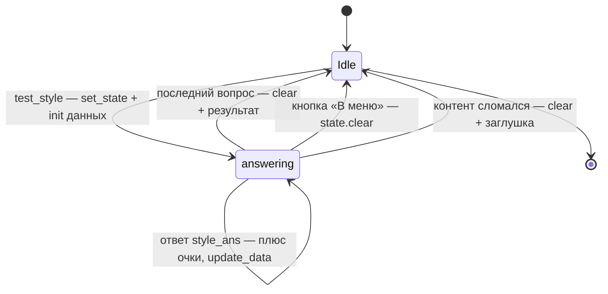

# Лекция 7. FSM: машина состояний

**Цель:** разобрать встроенный в aiogram конечный автомат (FSM) — механизм
многошаговых сценариев. На примере теста «Какой стиль тебе подходит» увидим, как
бот помнит, *где* в диалоге находится пользователь и *что* он успел накопить.

**Нужно заранее:** [Лекция 3](03-routers-handlers-filters.md) (фильтры,
`callback_query`), [Лекция 4](04-keyboards-callback-data.md) (динамические
клавиатуры).

---

## 1. Проблема, которую решает FSM

Бот реагирует на отдельные апдейты и между ними «ничего не помнит»: каждый хендлер
вызывается заново, локальные переменные не сохраняются. Это нормально для
одношаговых действий («показать факт»). Но тест на стиль — **многошаговый**: пять
вопросов подряд, и на каждом надо помнить две вещи:

1. **на каком вопросе** сейчас пользователь;
2. **сколько очков** по каждому стилю он уже набрал.

Где это хранить? В глобальной переменной — нельзя (пользователей много, перемешается).
В БД — избыточно (это короткоживущий прогресс, не нужный после теста). Нужен
механизм «состояние диалога на пользователя». Это и есть **FSM** (finite state
machine) — встроенная в aiogram машина состояний.

Две вещи, которые даёт FSM:

- **Состояние** — метка «в каком шаге сценария пользователь». Пока метка
  установлена, срабатывают только хендлеры этого состояния.
- **Данные состояния** — произвольный словарь, привязанный к пользователю
  (`question`, `scores`).

---

## 2. Объявление состояний: `StatesGroup`

Состояния описываются декларативно — классами. Файл `states/states.py` целиком:

```python
from aiogram.fsm.state import State, StatesGroup


class StyleTest(StatesGroup):
    """Тест «Какой стиль рока тебе подходит» (копим очки по стилям)."""
    answering = State()


class Quest(StatesGroup):
    """Квест «Спаси концерт» (храним текущий узел графа)."""
    playing = State()
```

`StatesGroup` — группа связанных состояний, `State()` — отдельное состояние внутри
неё. Здесь у каждого сценария **одно** состояние: тест всё время «отвечает на
вопрос» (`StyleTest.answering`), квест всё время «играет» (`Quest.playing`). Шаги
внутри (номер вопроса, узел графа) хранятся не как отдельные состояния, а в
*данных* — так гибче (об этом раздел 5).

Зачем выделять состояния в отдельный модуль? Чтобы и хендлеры, и фильтры ссылались
на один и тот же объект `StyleTest.answering`. Это, по сути, перечисление меток
сценариев.

> FSM может быть и сложнее: несколько состояний в группе (`waiting_name`,
> `waiting_age`, `confirm`) для пошаговых форм-визардов, с переходами между ними. В
> нашем боте сценарии простые, поэтому хватает одного состояния + данных.

---

## 3. Хранилище состояний и `FSMContext`

Чтобы FSM работал, диспетчеру при создании дают **хранилище** (лекция 1):

```python
dp = Dispatcher(storage=MemoryStorage())
```

`MemoryStorage` хранит состояния и их данные **в оперативной памяти процесса**.
Следствие: при перезапуске бота все недопройденные тесты и квесты обнуляются. Для
развлекательного бота это приемлемо — никто не теряет ничего важного. Если бы нужно
было переживать рестарт (или масштабироваться на несколько процессов), берут
персистентное хранилище — например, `RedisStorage`; интерфейс тот же, меняется одна
строка.

Доступ к состоянию в хендлере — через объект `FSMContext`, который aiogram
**подставляет сам**, если объявить параметр `state`:

```python
async def style_start(callback: CallbackQuery, state: FSMContext) -> None:
    ...
```

Это та же инъекция зависимостей по аннотации, что и с `Message`/`CallbackQuery`
(лекция 3). Объявили `state: FSMContext` — получили контекст FSM именно этого
пользователя в этом чате. У него четыре ключевых метода:

| Метод | Что делает |
|-------|------------|
| `await state.set_state(StyleTest.answering)` | установить состояние |
| `await state.update_data(question=0, scores={})` | записать/обновить данные (merge) |
| `await state.get_data()` | прочитать данные (dict) |
| `await state.clear()` | сбросить и состояние, и данные |

---

## 4. Тест на стиль: полный проход

Теперь соберём всё на реальном сценарии. Тест на стиль — это «аккумулятор очков»:
каждый ответ добавляет очки разным стилям, в конце побеждает стиль с максимумом.

### 4.1. Старт: ставим состояние и инициализируем данные

```python
@router.callback_query(F.data == "test_style")
async def style_start(callback: CallbackQuery, state: FSMContext) -> None:
    await callback.answer()
    quiz = config.load_content("quiz_style.json", default={})
    questions = quiz.get("questions") or []
    if not questions:
        await safe_edit(callback, CONTENT_ERROR_TEXT, style_result_kb())
        return

    # Начинаем тест: очки пустые, вопрос нулевой.
    await state.set_state(StyleTest.answering)
    await state.update_data(question=0, scores={})
    await _show_style_question(callback, quiz, 0)
```

Три шага старта:

1. **Проверка контента.** Загружаем `quiz_style.json`; если вопросов нет —
   аккуратная заглушка `CONTENT_ERROR_TEXT` (помните про устойчивость к плохому
   контенту, лекция 2). В тест не входим.
2. **`set_state(StyleTest.answering)`** — переводим пользователя в состояние
   «отвечает». С этого момента его нажатия `style_ans:*` пойдут в хендлер ответа
   (раздел 4.2).
3. **`update_data(question=0, scores={})`** — инициализируем прогресс: нулевой
   вопрос, пустой словарь очков.

Затем `_show_style_question` рисует текущий вопрос. Клавиатуру вариантов он строит
**из данных** — это та самая динамическая клавиатура `style_options_kb(options)` из
лекции 4:

```python
async def _show_style_question(callback, quiz, q_index):
    question = quiz["questions"][q_index]
    total = len(quiz["questions"])
    text = (
        f"🎸 <b>{html.escape(quiz.get('title', 'Тест'))}</b>\n"
        f"Вопрос {q_index + 1} из {total}\n\n"
        f"{html.escape(question['q'])}"
    )
    await safe_edit(callback, text, style_options_kb(question["options"]))
```

Текст и кнопки берутся из JSON; `q_index + 1 из total` даёт прогресс-индикатор.
`html.escape` — потому что текст вопроса из внешнего файла, а режим HTML (лекция 1).

### 4.2. Шаг: накопление очков и переход

Ответы ловит хендлер, отфильтрованный **И по состоянию, И по данным**:

```python
@router.callback_query(StyleTest.answering, F.data.startswith("style_ans:"))
async def style_answer(callback: CallbackQuery, state: FSMContext) -> None:
    await callback.answer()
    quiz = config.load_content("quiz_style.json", default={})
    questions = quiz.get("questions") or []

    data = await state.get_data()
    q_index = data.get("question", 0)
    scores = data.get("scores", {})
    option_index = int(callback.data.split(":")[1])

    # Защита от устаревших кнопок и изменившегося контента.
    if not questions or q_index >= len(questions) or option_index >= len(questions[q_index]["options"]):
        await state.clear()
        await safe_edit(callback, CONTENT_ERROR_TEXT, style_result_kb())
        return

    # Прибавляем очки выбранного варианта.
    chosen = questions[q_index]["options"][option_index]
    for style, points in chosen.get("scores", {}).items():
        scores[style] = scores.get(style, 0) + points

    q_index += 1
    if q_index < len(questions):
        await state.update_data(question=q_index, scores=scores)
        await _show_style_question(callback, quiz, q_index)
    else:
        await state.clear()
        await _show_style_result(callback, quiz, scores)
```

Разберём по слоям — здесь сконцентрирована вся суть FSM.

**Фильтр `StyleTest.answering, F.data.startswith("style_ans:")`.** Хендлер
сработает, только если пользователь *в состоянии теста* **и** нажал кнопку ответа.
Состояние как фильтр — почему это важно: те же кнопки вне теста (например, из
старого сообщения) сюда не попадут — их перехватит fallback (лекция 9). Состояние
изолирует сценарий.

**Чтение прогресса.** `data = await state.get_data()` достаёт сохранённый словарь;
из него — текущий `question` и накопленные `scores`. Это и есть «память» между
шагами.

**Защита.** Перед использованием индексов — проверка, что контент не изменился под
ногами (вопросов стало меньше, вариант вне диапазона). Если да — `clear()` и
заглушка. Контент живой и читается каждый раз (лекция 2), поэтому между вопросами
файл мог поменяться — код к этому готов.

**Накопление.** Сердце теста:

```python
for style, points in chosen.get("scores", {}).items():
    scores[style] = scores.get(style, 0) + points
```

У выбранного варианта в JSON есть `scores`, например `{"metal": 2, "punk": 1}`. Эти
очки прибавляются к накопленным. `scores.get(style, 0)` — «текущее или ноль».
Заметьте: код **не знает названий стилей** — он просто складывает то, что в данных.
Стили заданы в JSON. Это снова принцип «код vs контент»: движок универсален,
наполнение снаружи.

**Переход.** `q_index += 1`; если есть ещё вопросы — `update_data` (сохранить
новый прогресс) и показать следующий; иначе — `clear()` и результат.

`update_data` делает **merge**, а не замену: `update_data(question=q_index,
scores=scores)` обновляет эти ключи, не затирая остального. Это удобно — кладёте
только то, что изменилось.

### 4.3. Результат: argmax и запись

```python
async def _show_style_result(callback, quiz, scores):
    results = quiz.get("results", {})
    if not scores or not results:
        await safe_edit(callback, CONTENT_ERROR_TEXT, style_result_kb())
        return

    best = max(scores, key=scores.get)   # стиль с максимумом очков
    result = results.get(best)
    if not result:
        await safe_edit(callback, CONTENT_ERROR_TEXT, style_result_kb())
        return

    await db.save_quiz_result(callback.from_user.id, "style", best)
    text = (
        f"Твой стиль: <b>{html.escape(result['title'])}</b>\n\n"
        f"{html.escape(result['desc'])}"
    )
    await safe_edit(callback, text, style_result_kb())
```

`max(scores, key=scores.get)` — лаконичный **argmax**: вернуть ключ (стиль) с
наибольшим значением (очками). Описание победившего стиля берётся из блока
`results` того же JSON. Результат пишется в БД (`save_quiz_result`, лекция 6) — для
аналитики. Состояние к этому моменту уже сброшено (`clear()` сделали в `style_answer`).

---

## 5. Жизненный цикл состояния — диаграмма



Ключевое наблюдение: из состояния `answering` есть **несколько выходов**, и каждый
делает `clear()`. Нормальный (последний вопрос), ручной (кнопка «В меню»), аварийный
(сломанный контент). Незакрытое состояние — это «застрявший» пользователь, у
которого работают только хендлеры теста. Поэтому `clear()` дисциплинированно стоит
на каждом выходе.

Особо: кнопка «В меню» доступна на каждом шаге теста (она в `style_options_kb`), и
её хендлер в `menu.py` начинается с `await state.clear()`:

```python
@router.callback_query(F.data == "go_menu")
async def back_to_menu(callback: CallbackQuery, state: FSMContext) -> None:
    await state.clear()  # сбрасываем незаконченный тест/квест
    await callback.answer()
    await show_main_menu(callback)
```

Один общий хендлер «назад в меню» страхует выход из *любого* сценария — и теста, и
квеста. Это важная деталь устойчивости: куда бы пользователь ни забрёл, «В меню»
всегда вычистит состояние.

---

## 6. Где ещё используется FSM: квест

Квест «Спаси концерт» устроен по той же схеме, только в данных хранится не номер
вопроса, а **текущий узел графа**:

```python
await state.set_state(Quest.playing)
# ...
await state.update_data(node=node_id)
```

Состояние `Quest.playing` изолирует нажатия `quest:*`, а `node` в данных помнит,
где в сюжете пользователь. Полностью движок квеста — следующая лекция; здесь важно
увидеть, что **один и тот же механизм FSM** обслуживает два разных сценария, меняя
лишь то, что лежит в данных состояния.

---

## 7. Частые грабли

- **Забыть `storage` у диспетчера.** Без `Dispatcher(storage=...)` FSM не работает.
- **Не сделать `clear()` на выходе.** Пользователь «залипает» в состоянии: обычные
  кнопки могут не работать, потому что активны только хендлеры состояния.
- **Хранить много/тяжёлое в данных FSM.** Это оперативка процесса. Прогресс —
  да; большие объекты или то, что должно пережить рестарт, — в БД.
- **Путать `set_state` и `update_data`.** Первое — *где* пользователь (метка),
  второе — *что* он накопил (словарь). Нужны оба.
- **Не фильтровать хендлер по состоянию.** Тогда кнопки сценария будут срабатывать
  и вне его. Состояние в фильтре — часть изоляции сценария.

---

### Итоги лекции

- FSM решает многошаговость: помнит, **где** пользователь (состояние) и **что** он
  накопил (данные), отдельно для каждого пользователя.
- Состояния объявляются через `StatesGroup`/`State`; хранилище — `MemoryStorage`
  (в памяти, гибнет при рестарте; заменяемо на Redis без смены кода хендлеров).
- `FSMContext` инъектируется по аннотации `state`; методы `set_state`,
  `update_data` (merge), `get_data`, `clear`.
- Тест на стиль = аккумулятор: на старте `set_state`+инициализация, на каждом шаге
  прибавляем `scores` из JSON и `update_data`, в конце `argmax` + `clear` + запись
  в БД. Движок не знает названий стилей — они в контенте.
- `clear()` обязателен на **каждом** выходе; общий хендлер «В меню» страхует выход
  из любого сценария.

**Дальше:** [Лекция 8. Движок квеста: сюжет как граф →](08-quest-graph-engine.md)
