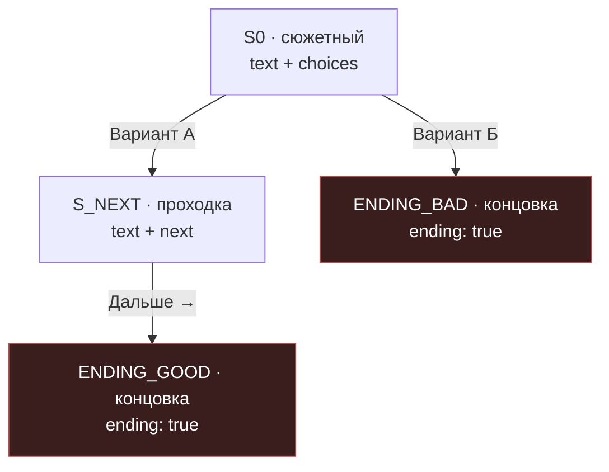
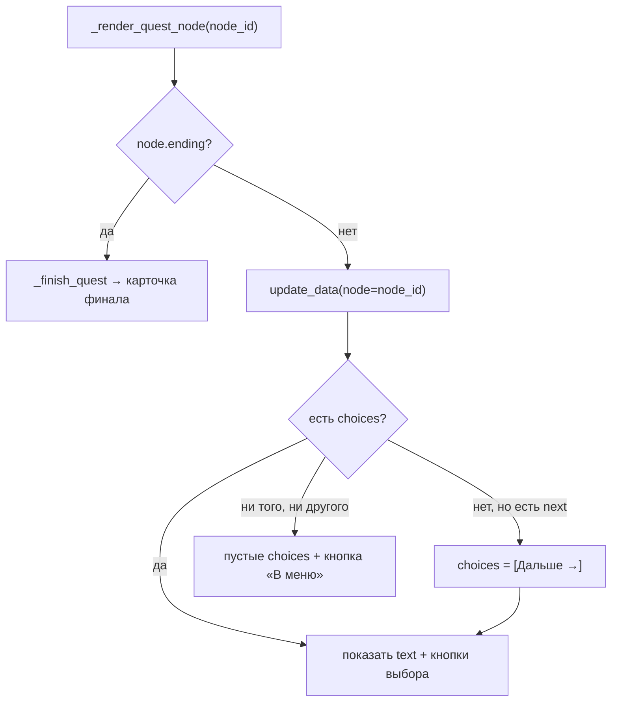
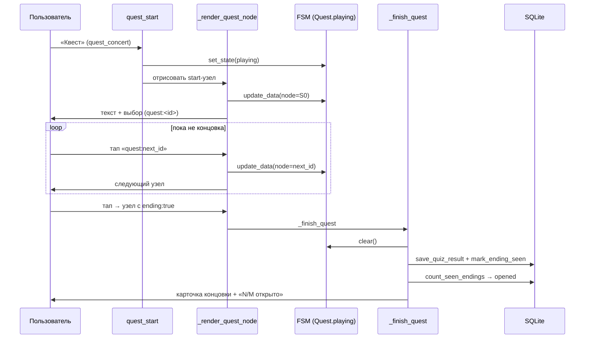

# Лекция 8. Движок квеста: сюжет как граф

**Цель:** разобрать самую интересную с инженерной точки зрения подсистему —
квест «Спаси концерт». Это **data-driven движок графа**: сам сюжет не зашит в код,
а описан в JSON, а код умеет проигрывать *любой* такой граф. Образцовое применение
принципа «код vs контент».

**Нужно заранее:** [Лекция 7](07-fsm-states.md) (FSM, `Quest.playing`, данные
состояния), [Лекция 4](04-keyboards-callback-data.md) (`callback_data`, лимит).

---

## 1. Главная идея: сюжет — это данные, а не код

Наивный способ написать ветвящийся квест — `if/elif` по сюжету:

```python
# ❌ как НЕ сделано
if node == "S0":
    if choice == "A": show("S1")
    elif choice == "B": show("ENDING_BAD")
elif node == "S1":
    ...
```

Это кошмар в сопровождении: каждая новая сцена — правка кода, ветвление
размазано, ошибиться легко. Проект идёт другим путём: сюжет — это **граф**,
описанный в `quest_concert.json`, а код — **универсальный интерпретатор** этого
графа. Хотите другой сюжет — переписываете JSON, Python не трогаете.

Это ровно тот же приём, что в тесте на стиль (движок не знает названий стилей), но
доведённый до полноценного движка: код не знает *ни одной* конкретной сцены.

---

## 2. Структура графа в JSON

Граф — это словарь узлов плюс указатель на стартовый узел:

```json
{
  "start": "S0",
  "nodes": {
    "S0": {
      "text": "Текст ситуации.\n\nЧто делаешь?",
      "choices": [
        {"text": "Вариант А", "next": "S_NEXT"},
        {"text": "Вариант Б", "next": "ENDING_BAD"}
      ]
    },
    "S_NEXT": {
      "text": "Промежуточная сцена без выбора.",
      "next": "ENDING_GOOD"
    },
    "ENDING_GOOD": {
      "ending": true,
      "title": "Название концовки",
      "text": "Финальный текст.",
      "verdict": "Что в итоге.",
      "rank": "Звание игрока",
      "rarity": "Очень редкая",
      "score": "10/10"
    },
    "ENDING_BAD": {
      "ending": true, "title": "Провал", "text": "...",
      "rarity": "Обычная", "score": "3/10"
    }
  }
}
```

Узел (`node`) бывает **трёх видов** — и это вся «грамматика» движка:

1. **Сюжетный узел** — есть `text` и `choices` (список вариантов). Каждый вариант
   ведёт на следующий узел через `next`. Это развилка.
2. **Нода-проходка** — есть `text` и одно поле `next` (без `choices`). Сцена без
   выбора: движок покажет одну кнопку «Дальше →». Нужна для повествования между
   развилками.
3. **Концовка** — `"ending": true`. Финал: показывает карточку (заголовок, текст,
   и необязательные `verdict`, `rank`, `rarity`, `score`) и завершает квест.

Идентификаторы узлов (`S0`, `S_NEXT`, `ENDING_GOOD`) держат **короткими**
сознательно: они уходят в `callback_data` как `quest:<id>`, а там лимит 64 байта
(лекция 4).



---

## 3. Старт квеста

```python
@router.callback_query(F.data == "quest_concert")
async def quest_start(callback: CallbackQuery, state: FSMContext) -> None:
    await callback.answer()
    quest = config.load_content("quest_concert.json", default={})
    nodes = quest.get("nodes", {})
    start_node = quest.get("start")
    if not start_node or start_node not in nodes:
        await safe_edit(callback, CONTENT_ERROR_TEXT, quest_end_kb())
        return

    await state.set_state(Quest.playing)
    await _render_quest_node(callback, state, nodes, start_node)
```

Шаги те же, что у любого FSM-сценария (лекция 7): загрузить контент, проверить его
(`start` существует и есть среди `nodes` — иначе заглушка), войти в состояние
`Quest.playing`, отрисовать стартовый узел. Вся отрисовка делегирована
`_render_quest_node` — это «сердце» движка.

---

## 4. Шаг квеста

Каждое нажатие в квесте — это `callback_data` вида `quest:<id_следующего_узла>`.
Ловит его хендлер, отфильтрованный по состоянию `Quest.playing`:

```python
@router.callback_query(Quest.playing, F.data.startswith("quest:"))
async def quest_step(callback: CallbackQuery, state: FSMContext) -> None:
    await callback.answer()
    quest = config.load_content("quest_concert.json", default={})
    nodes = quest.get("nodes", {})
    next_node = callback.data.split(":", 1)[1]

    if next_node not in nodes:
        await state.clear()
        await safe_edit(callback, CONTENT_ERROR_TEXT, quest_end_kb())
        return

    await _render_quest_node(callback, state, nodes, next_node)
```

Логика прозрачна: достать id следующего узла из коллбэка (`split(":", 1)` — ровно
одно разбиение, чтобы не пострадать от двоеточия в id, лекция 4), проверить, что
такой узел есть, и отрисовать. **Куда идти, решает кнопка**, а не код: id целевого
узла зашит в `callback_data` самой кнопкой при отрисовке предыдущего узла. Это и
делает движок не знающим сюжета — он просто переходит туда, куда указала нажатая
кнопка.

Заметьте, что `nodes` перечитываются на каждом шаге (`load_content`). Контент
живой — между шагами JSON могли поправить; код это переживает (проверка
`next_node not in nodes`).

---

## 5. Сердце движка: `_render_quest_node`

Одна функция отрисовывает **любой** узел, различая три его вида:

```python
async def _render_quest_node(callback, state, nodes, node_id):
    """Универсальный движок графа: рисует узел. На концовке — завершает квест."""
    node = nodes[node_id]
    if node.get("ending"):
        await _finish_quest(callback, state, nodes, node_id, node)
        return

    await state.update_data(node=node_id)
    choices = node.get("choices")
    if not choices and node.get("next"):
        choices = [{"text": "Дальше →", "next": node["next"]}]
    text = html.escape(node.get("text", ""))
    await safe_edit(callback, text, quest_choices_kb(choices or []))
```

Здесь всего несколько строк, но они реализуют всю «грамматику» из раздела 2:

- **Концовка?** `if node.get("ending")` → передаём в `_finish_quest` и выходим.
  Концовки рисуются иначе (карточка с метаданными, раздел 6).
- **Иначе сохраняем позицию.** `update_data(node=node_id)` — кладём в данные FSM
  текущий узел (это и есть «память» квеста, лекция 7).
- **Нормализация проходки в выбор.** Ключевой трюк:

  ```python
  choices = node.get("choices")
  if not choices and node.get("next"):
      choices = [{"text": "Дальше →", "next": node["next"]}]
  ```

  Если у узла нет `choices`, но есть `next` (нода-проходка), движок **на лету
  собирает** искусственный список из одного варианта «Дальше →». Благодаря этому
  дальше код одинаков для обоих видов: и развилка, и проходка превращаются в
  «список choices», который рисует одна и та же клавиатура `quest_choices_kb`
  (лекция 4). Элегантное сведйние двух случаев к одному.

- **Отрисовка.** Текст экранируется (HTML, внешний контент) и показывается с
  клавиатурой вариантов. `choices or []` — страховка: если узел сломан (ни
  `choices`, ни `next`), будет пустой список вариантов, но останется кнопка «В
  меню» из `quest_choices_kb` — пользователь не застрянет.



---

## 6. Концовка: запись, счётчик, карточка

Финал обрабатывает `_finish_quest`:

```python
async def _finish_quest(callback, state, nodes, ending_id, node):
    """Концовка: сохраняем результат, обновляем счётчик и показываем карточку."""
    await state.clear()
    user_id = callback.from_user.id
    await db.save_quiz_result(user_id, "quest_concert", ending_id)
    await db.mark_ending_seen(user_id, ending_id)

    opened = await db.count_seen_endings(user_id)
    total = sum(1 for n in nodes.values() if n.get("ending"))
    await safe_edit(callback, _format_ending(node, opened, total), quest_end_kb())
```

Что здесь происходит и почему:

- **`state.clear()`** — квест окончен, выходим из FSM (дисциплина из лекции 7).
- **Две записи в БД** (лекция 6):
  - `save_quiz_result(...)` — пишем в журнал «прошёл квест с такой концовкой» (для
    аналитики, допускает повторы).
  - `mark_ending_seen(...)` — идемпотентно (`INSERT OR IGNORE`) отмечаем **открытую
    концовку**. Повторное открытие той же концовки счётчик не накрутит.
- **Прогресс «открыто N из M».** `opened` — сколько *разных* концовок открыл
  пользователь (`count_seen_endings`). `total` — сколько концовок вообще есть в
  графе, считается **прямо из данных**:

  ```python
  total = sum(1 for n in nodes.values() if n.get("ending"))
  ```

  Снова «код vs контент»: движок не знает заранее, сколько в сюжете финалов — он
  считает узлы с `ending: true`. Добавили концовку в JSON — `total` сам вырос.
  Это создаёт **геймификацию**: мотив «собрать все концовки», и счётчик честно
  отражает прогресс по текущему графу.

---

## 7. Сборка карточки концовки

Финальный экран собирает `_format_ending` — из тех полей узла, что заданы:

```python
def _format_ending(node, opened, total):
    parts = []
    if node.get("title"):
        parts.append(f"🏁 <b>{html.escape(str(node['title']))}</b>")
    if node.get("text"):
        parts.append(html.escape(str(node["text"])))

    meta = []
    if node.get("verdict"):
        meta.append(f"🎯 <b>Вердикт:</b> {html.escape(str(node['verdict']))}")
    if node.get("rank"):
        meta.append(f"🏆 <b>Звание:</b> {html.escape(str(node['rank']))}")
    rarity = html.escape(str(node.get("rarity", ""))).strip()
    score = html.escape(str(node.get("score", ""))).strip()
    if rarity or score:
        sep = " · " if rarity and score else ""
        meta.append(f"🃏 <b>Редкость:</b> {rarity}{sep}{score}")
    if meta:
        parts.append("\n".join(meta))

    if total:
        progress = f"📒 Открыто концовок: <b>{opened}/{total}</b>"
        if opened >= total:
            progress += "\n🎉 Ты собрал все концовки! Уважение 🤘"
        parts.append(progress)

    return "\n\n".join(parts)
```

Главный принцип здесь — **всё опционально**. Каждое поле добавляется только если
оно есть в узле (`if node.get(...)`). Концовка может иметь только `title` и `text`,
а может — полную «карточку трофея» с вердиктом, званием, редкостью и счётом. Редактор
контента сам решает, насколько богатой будет концовка; код не требует обязательных
полей и не падает на их отсутствии.

Мелкие, но показательные детали:

- **`str(...)` вокруг значений.** Подстраховка на случай, если в JSON `score`
  записали числом (`10`), а не строкой (`"10/10"`). `str()` + `html.escape`
  переживут любой тип.
- **Умный разделитель.** `sep = " · " if rarity and score else ""` — точка-разделитель
  ставится, только когда есть *оба* значения; иначе не будет висящего « · ».
- **Сборка через список + `join`.** Блоки накапливаются в `parts`, потом
  склеиваются через `\n\n`. Так пустые блоки не оставляют лишних переводов строк —
  чистая компоновка переменного числа секций.
- **Поздравление за 100%.** `if opened >= total` добавляет строку «собрал все
  концовки» — завершает геймификацию.

---

## 8. Полная карта потоков квеста



---

## 9. Почему это хороший дизайн

Стоит отдельно отметить инженерные достоинства, которые переносятся на ваши проекты:

- **Расширяемость без кода.** Новая ветка, сцена, концовка — это правка JSON. Сюжет
  пишет сценарист, не программист.
- **Минимальное ядро.** Весь движок — это `_render_quest_node` (десяток строк) +
  старт/шаг/финал. Сложность — в данных, а не в коде; код прост и легко проверяется.
- **Сведение случаев к одному.** Проходка нормализуется в «выбор из одного
  варианта», и дальше путь общий. Меньше веток — меньше багов.
- **Геймификация из данных.** `total` считается из графа, прогресс «N/M» работает
  для любого сюжета автоматически.
- **Устойчивость.** На каждом шаге — проверка существования узла, экранирование,
  страховочные `or []` и `clear()` при поломке. Живой контент не роняет бота.

Это образец того, как «интерпретатор + декларативные данные» побеждает «жёстко
зашитую логику» в задачах с ветвлением.

---

### Итоги лекции

- Квест — data-driven движок графа: сюжет в `quest_concert.json`, код — универсальный
  интерпретатор, не знающий конкретных сцен.
- Три вида узлов: сюжетный (`text`+`choices`), проходка (`text`+`next`), концовка
  (`ending: true`). Куда идти — решает `callback_data` кнопки (`quest:<id>`).
- `_render_quest_node` различает виды, нормализует проходку в «один выбор», сохраняет
  узел в FSM и рисует общей клавиатурой.
- Концовка: `clear()` + две записи в БД (журнал и идемпотентная отметка), прогресс
  «открыто N/M», где `total` считается из графа (`ending: true`).
- `_format_ending` собирает карточку из опциональных полей через `parts`+`join` —
  всё необязательно, ничего не падает.

**Дальше:** [Лекция 9. UX сообщений и устойчивость →](09-ux-messages-fallback.md)
