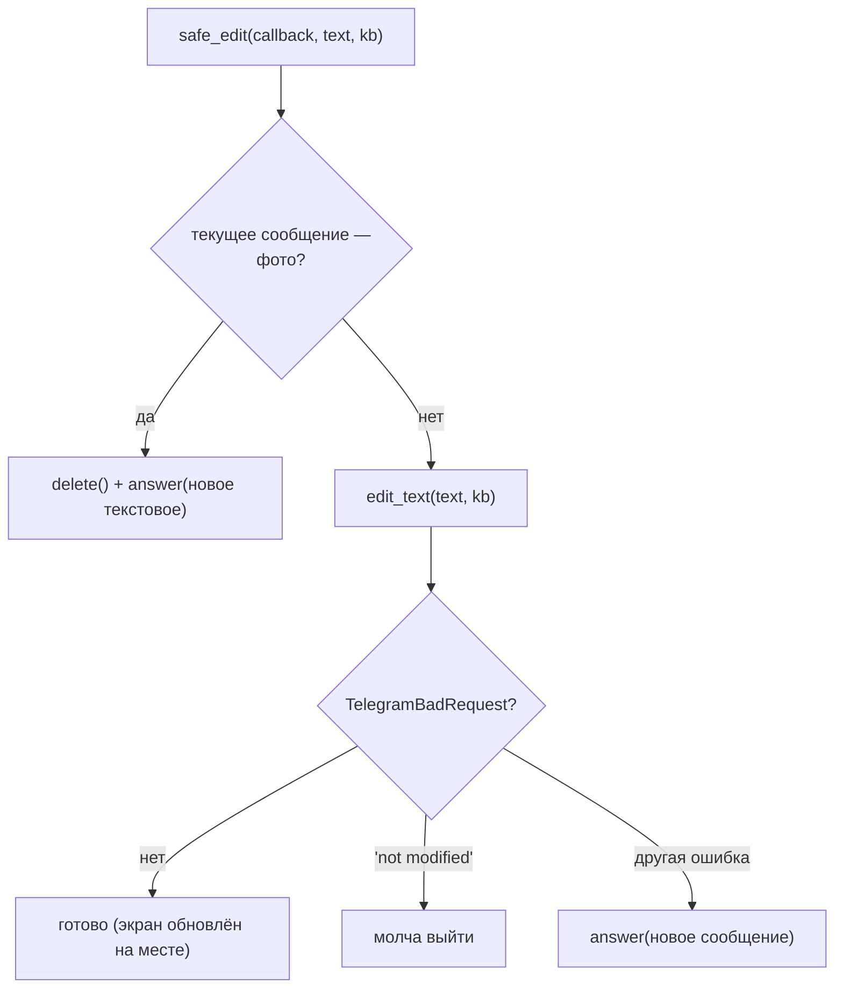
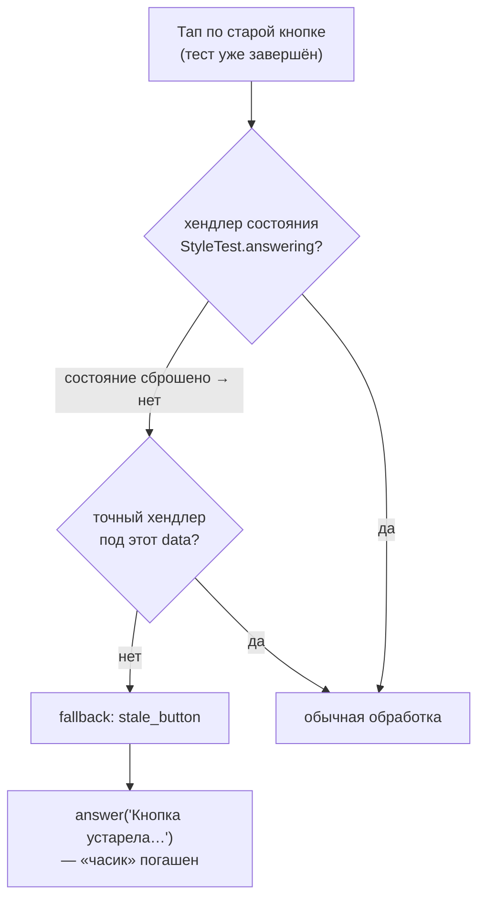

# Лекция 9. UX сообщений и устойчивость

**Цель:** разобрать тонкости, которые отделяют «работает» от «работает приятно»:
почему экран **редактируется**, а не шлётся заново; почему фото и текст —
несовместимы и как с этим живёт `safe_edit`; зачем кешируется `file_id` баннера; и
как fallback-роутер гасит «часик» на устаревших кнопках.

**Нужно заранее:** [Лекция 3](03-routers-handlers-filters.md) (`callback_query`,
`.answer()`), [Лекция 5](05-middleware-subscription-gate.md) (приём «edit с
откатом»).

---

## 1. Парадигма «экран», а не «лента сообщений»

Большинство ботов-меню работают как **сменяющиеся экраны**: одно сообщение бота
превращается из меню в раздел, из раздела — обратно в меню. Чат не засоряется
десятком сообщений — пользователь всё время видит один «экран», под которым меняются
текст и кнопки.

Технически это значит: вместо `answer` (отправить новое) мы используем `edit_text`
(переписать текущее). Нажал «Тесты» — то же сообщение стало меню тестов; нажал
«В меню» — оно же снова стало главным меню. Inline-клавиатуры существуют именно для
такого паттерна (лекция 4).

Но у редактирования есть две ловушки, и обе обходит один помощник — `safe_edit`.

---

## 2. Ловушка №1: «message is not modified»

Если попытаться отредактировать сообщение, подставив **тот же** текст и ту же
клавиатуру, Telegram вернёт ошибку `TelegramBadRequest: message is not modified`.
Когда это случается? Например, пользователь дважды нажал одну кнопку — второй раз
контент тот же. Если ошибку не поймать — бот упадёт на ровном месте.

## 3. Ловушка №2: фото нельзя превратить в текст

Главное меню может показываться **с картинкой-баннером** (фото-сообщение с
подписью). А разделы — текстовые. Telegram **не позволяет** отредактировать
фото-сообщение в текстовое и наоборот: это разные типы сообщений. Попытка
`edit_text` на фото-сообщении — снова `TelegramBadRequest`.

Значит, переход «меню-с-баннером → текстовый раздел» нельзя сделать
редактированием. Нужно **удалить** фото-сообщение и **отправить** новое текстовое.

---

## 4. `safe_edit`: универсальный «показать текст под кнопкой»

Обе ловушки инкапсулированы в одной функции из `menu.py`, которую импортируют почти
все разделы (`facts`, `tests`, `events`):

```python
async def safe_edit(callback: CallbackQuery, text: str, reply_markup=None) -> None:
    """Показывает текстовый экран под кнопкой."""
    msg = callback.message
    if msg.photo:
        try:
            await msg.delete()
        except TelegramBadRequest:
            pass
        await msg.answer(text, reply_markup=reply_markup)
        return
    try:
        await msg.edit_text(text, reply_markup=reply_markup)
    except TelegramBadRequest as e:
        if "message is not modified" in str(e):
            return
        await msg.answer(text, reply_markup=reply_markup)
```

Логика покрывает все случаи:

- **Сообщение — фото** (`msg.photo`): редактировать в текст нельзя → удаляем
  (поглощая ошибку, если уже удалено) и шлём новое текстовое. Это решает ловушку №2.
- **Сообщение — текст**: пробуем `edit_text` (наш основной путь — смена экрана на
  месте).
  - Если поймали `message is not modified` — **просто выходим** молча: контент тот
    же, ничего показывать не надо. Это решает ловушку №1.
  - Любая другая `TelegramBadRequest` (например, сообщение слишком старое для
    редактирования) → откат на отправку нового. Бот не падает в любом случае.

Ценность `safe_edit` в том, что **все разделы** вызывают её, не думая о типах
сообщений и об ошибках Telegram. Один помощник — единое, предсказуемое поведение
навигации во всём боте. Это пример того, как UX-сложность инкапсулируется в одном
месте, а прикладной код остаётся чистым: `await safe_edit(callback, text, kb)`.



---

## 5. Меню с баннером и обратный переход

Симметричная задача — показать **меню** (которое может быть с фото) поверх текущего
экрана. Этим занимается `show_main_menu`. Здесь все четыре комбинации «было/стало»
разруливаются явно:

```python
async def show_main_menu(event: Message | CallbackQuery, greeting: bool = False) -> None:
    text = WELCOME_TEXT if greeting else MENU_TEXT
    kb = main_menu_kb()
    banner = _banner_source()

    # /start — событие Message: просто шлём новое сообщение.
    if isinstance(event, Message):
        if banner is None:
            await event.answer(text, reply_markup=kb)
        else:
            await _send_photo(event, banner, text, kb)
        return

    # Callback: без баннера — обычное текстовое меню.
    msg = event.message
    if banner is None:
        await safe_edit(event, text, kb)
        return
    # Баннер есть: фото-меню обновляем подписью, иначе пересоздаём.
    if msg.photo:
        try:
            await msg.edit_caption(caption=text, reply_markup=kb)
            return
        except TelegramBadRequest as e:
            if "message is not modified" in str(e):
                return
    try:
        await msg.delete()
    except TelegramBadRequest:
        pass
    await _send_photo(msg, banner, text, kb)
```

Разбор веток:

- **Событие — `Message`** (пришли из `/start`): просто отправляем меню (с фото или
  без). Редактировать нечего — это новый диалог.
- **Событие — `CallbackQuery`, баннера нет**: текстовое меню через `safe_edit` —
  переиспользуем уже разобранную логику.
- **Баннер есть, текущее сообщение уже фото**: не пересоздаём — **редактируем
  подпись** (`edit_caption`). Это дешевле и не мигает: фото остаётся, меняется
  только текст-подпись и кнопки.
- **Баннер есть, но текущее сообщение текстовое** (возврат из текстового раздела в
  меню-с-баннером): текст в фото не превратить → удаляем и шлём фото-меню.

Обратите внимание: **переход в обе стороны несимметричен по стоимости**. Текст↔текст
— дешёвое редактирование. Любой переход с участием фото — удаление+отправка (мигание
сообщения). Это плата за красивый баннер, и код честно её платит только когда
нужно.

---

## 6. Кеш `file_id`: не грузить картинку каждый раз

Когда вы отправляете фото впервые, Telegram принимает файл и возвращает его
`file_id` — короткий идентификатор уже загруженного файла на серверах Telegram.
Повторно слать тот же файл с диска не нужно: достаточно передать `file_id`, и
Telegram возьмёт картинку у себя. Проект этим пользуется через модульный кеш:

```python
# file_id баннера кешируется после первой отправки, чтобы не грузить файл каждый раз.
_banner_file_id: str | None = None

async def _send_photo(target: Message, banner, caption: str, reply_markup) -> None:
    global _banner_file_id
    sent = await target.answer_photo(banner, caption=caption, reply_markup=reply_markup)
    if _banner_file_id is None and sent.photo:
        _banner_file_id = sent.photo[-1].file_id
```

И источник картинки сначала смотрит в кеш:

```python
def _banner_source():
    """Картинка для меню: file_id из кеша, URL или файл с диска. None — если нет."""
    if _banner_file_id:
        return _banner_file_id      # уже загружали — отдаём id
    value = (config.MENU_IMAGE or "").strip()
    if value.startswith("http"):
        return value                # картинка по URL
    candidates = [Path(value)] if value else []
    for ext in ("jpg", "jpeg", "png", "webp"):
        candidates.append(config.CONTENT_DIR / f"menu.{ext}")
    for path in candidates:
        if path.exists():
            return FSInputFile(str(path))   # файл с диска
    return None
```

Что здесь полезного присвоить:

- **Три источника картинки, по приоритету:** кеш `file_id` → URL из `MENU_IMAGE` →
  локальный файл (`content/menu.jpg/png/...`). Нет ничего — `None`, и меню просто
  текстовое. Гибко и устойчиво.
- **`sent.photo[-1].file_id`** — Telegram хранит несколько размеров фото;
  последний (`-1`) — самый большой. Берём его id.
- **Эффект кеша:** первая отправка грузит файл с диска (`FSInputFile`) и запоминает
  `file_id`; все последующие показы меню используют id — без чтения диска и
  повторной загрузки. Для часто показываемого баннера это заметная экономия.

Тонкость про время жизни: кеш — модульная переменная, живёт в памяти процесса и
обнуляется при перезапуске. Это нормально: после рестарта первый показ снова
загрузит файл и наполнит кеш. (`file_id`, к слову, привязан к конкретному боту —
ещё одна причина, почему его не стоит хранить дольше жизни процесса.)

---

## 7. `callback.answer()` и «часик» на кнопке

Маленькая, но обязательная деталь UX. Когда пользователь жмёт inline-кнопку,
Telegram показывает на ней индикатор загрузки («часик») и ждёт от бота
подтверждения, что нажатие принято. Подтверждение — это `callback.answer()`. Пока
его нет, «часик» крутится до таймаута — выглядит как зависание.

Поэтому **в каждом** callback-хендлере проекта есть `await callback.answer()` —
часто самой первой строкой:

```python
@router.callback_query(F.data == "menu_playlist")
async def show_playlist(callback: CallbackQuery) -> None:
    await callback.answer()      # гасим «часик» сразу
    ...
```

`answer()` умеет больше, чем просто гасить индикатор:

- `await callback.answer("текст")` — короткая всплывающая подсказка сверху.
- `await callback.answer("текст", show_alert=True)` — модальное окно с кнопкой
  «ОК». Так гейт показывает «ты ещё не подписан» (лекция 5).

---

## 8. Fallback: ловим устаревшие кнопки

Теперь — зачем нужен `fallback.py` (включённый роутером последним, лекция 3).
Представьте: пользователь прошёл тест, состояние сброшено (`clear()`), но в чате
осталось **старое** сообщение с кнопками вопроса. Он нажимает такую кнопку. Что
произойдёт?

- Хендлер ответа теста отфильтрован по состоянию `StyleTest.answering` (лекция 7), а
  состояние уже сброшено → хендлер не сработает.
- Точного хендлера под этот `callback_data` вне состояния тоже нет.
- Значит, апдейт **не поймает никто** из обычных роутеров → «часик» на кнопке
  крутится до таймаута. Плохой UX.

Чтобы этого не было, последним стоит catch-all роутер:

```python
@router.callback_query()                    # без фильтра — ловит ВСЁ оставшееся
async def stale_button(callback: CallbackQuery) -> None:
    await callback.answer("Кнопка устарела — открой раздел заново 🤘", show_alert=False)
```

Так как он последний (лекция 3), сюда попадают **только** нажатия, которые не забрал
ни один осмысленный хендлер. Он гасит «часик» и вежливо сообщает «кнопка устарела».
Это страховочная сетка: что бы ни нажал пользователь на старом экране, бот
отзовётся, а не «повиснет».



---

## 9. Сводка приёмов устойчивости

Эта лекция — про то, что бот не должен падать и «висеть» в реальных, неидеальных
условиях. Соберём приёмы воедино:

| Проблема реального мира | Приём в проекте |
|---|---|
| Повторное нажатие → «not modified» | `safe_edit` молча проглатывает эту ошибку |
| Фото нельзя редактировать в текст | `safe_edit` удаляет фото и шлёт новое |
| Сообщение слишком старое для edit | откат на `answer` (новое сообщение) |
| Повторная загрузка картинки | кеш `file_id` (`_banner_file_id`) |
| «Часик» на кнопке | `callback.answer()` в каждом хендлере |
| Нажата устаревшая кнопка | catch-all `fallback`, включён последним |
| Любой вызов API может бросить | точечные `try/except TelegramBadRequest` |

Общий принцип: **взаимодействие с Telegram ненадёжно по своей природе** (сообщения
устаревают, типы несовместимы, пользователь жмёт что попало), и устойчивый бот
обрабатывает это явно, деградируя мягко, а не падая.

---

### Итоги лекции

- Бот — это «экран», который **редактируется** (`edit_text`/`edit_caption`), а не
  лента новых сообщений; так работает навигация по меню.
- Две ловушки редактирования — `message is not modified` и несовместимость
  фото↔текст — инкапсулированы в `safe_edit`, которым пользуются все разделы.
- `show_main_menu` явно разруливает 4 комбинации «было/стало» с баннером; переходы с
  участием фото дороже (удаление+отправка).
- Кеш `file_id` (`_banner_file_id`) избавляет от повторной загрузки баннера; три
  источника картинки: кеш → URL → файл.
- `callback.answer()` обязателен в каждом callback-хендлере (гасит «часик», умеет
  алерты); catch-all `fallback` последним ловит устаревшие кнопки.
- Сквозной принцип — мягкая деградация при ненадёжном Telegram API.

**Дальше:** [Лекция 10. Запуск, логи, webhook, расширение →](10-deploy-and-extend.md)
