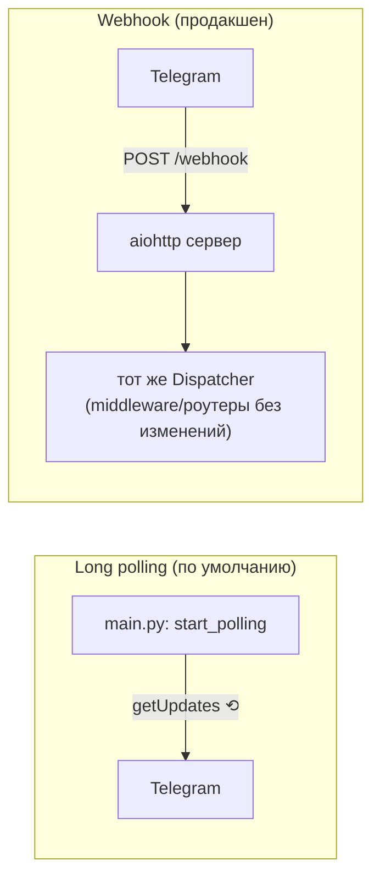
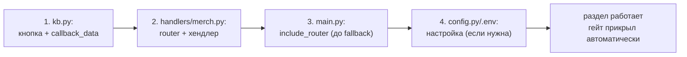

# Лекция 10. Запуск, логи, webhook, расширение

**Цель:** довести бота до эксплуатации и научиться его расширять. Соберём воедино
запуск и зависимости, логирование, админскую команду `/stats`, переключение
polling↔webhook, хостинг — и пройдём пошаговый рецепт «как добавить новый раздел».

**Нужно заранее:** удобно держать в голове [Лекцию 1](01-aiogram-basics.md)
(`main.py`), [Лекцию 3](03-routers-handlers-filters.md) (роутеры) и
[Лекцию 2](02-config-and-content.md) (контент).

---

## 1. Зависимости и запуск

Весь стек — три внешних пакета (`requirements.txt`):

```
aiogram==3.28.2
aiosqlite==0.22.1
python-dotenv==1.2.2
```

Версии **зафиксированы** (`==`), и это правильно для воспроизводимости: на сервере
встанет ровно то, что вы тестировали, без сюрпризов от новых релизов (особенно
важно для aiogram, где между минорными версиями бывают изменения API).

Канонический запуск с изоляцией окружения:

```bash
python -m venv .venv
source .venv/bin/activate        # Windows: .venv\Scripts\activate
pip install -r requirements.txt
cp .env.example .env             # затем заполнить BOT_TOKEN, CHANNEL_ID, ссылки, ADMIN_IDS
python main.py
```

`venv` обязателен: он изолирует зависимости проекта от системного Python. База
`bot.db` и лог `bot.log` создаются автоматически рядом с `main.py` при первом
запуске (лекции 1, 6).

Перед первым стартом — три вещи из README, без которых бот не заработает:

1. **Токен** у [@BotFather](https://t.me/BotFather) → в `.env` (`BOT_TOKEN`).
2. **Бот — администратор канала.** Без прав админа `get_chat_member` не сможет
   проверять подписку, и гейт закроется для всех (лекция 5).
3. **Свой Telegram id** (у @userinfobot) → в `ADMIN_IDS`, иначе `/stats` будет
   недоступен.

---

## 2. Логирование как инструмент эксплуатации

На сервере вы не видите консоль — логи становятся главным окном в жизнь бота.
Настройка (из `main.py`, лекция 1) пишет одновременно в консоль и в файл:

```python
logging.basicConfig(
    level=logging.INFO,
    format="%(asctime)s | %(levelname)s | %(name)s | %(message)s",
    handlers=[logging.StreamHandler(), logging.FileHandler(config.LOG_FILE, encoding="utf-8")],
)
```

В каждом модуле заведён именованный логгер `logger = logging.getLogger(__name__)`.
Благодаря `%(name)s` в формате в логе сразу видно, *какой модуль* написал строку:

```
2026-06-14 18:20:01 | INFO    | __main__ | Бот запускается (long polling)...
2026-06-14 18:20:01 | INFO    | database.db | База данных готова: bot.db
2026-06-14 18:25:13 | WARNING | middlewares.subscription | Не удалось проверить подписку user_id=12345: ...
```

Уровни используются осмысленно (это повторяющаяся в проекте дисциплина):

- **INFO** — нормальные события жизненного цикла (старт, остановка, БД готова).
- **WARNING** — «что-то не так, но мы справились»: не смогли проверить подписку
  (вероятно, бот не админ), отсутствует файл контента.
- **ERROR** — настоящие поломки: битый JSON в контенте (лекция 2).

Практический совет для эксплуатации: первым делом при странном поведении смотрите
`bot.log`. Варнинг про подписку почти всегда означает «бот не админ канала»; ошибка
JSON укажет точный файл и позицию.

---

## 3. Админская команда `/stats`

Единственная «командная» фича после `/start` — статистика для админов (`admin.py`):

```python
@router.message(Command("stats"))
async def cmd_stats(message: Message) -> None:
    if message.from_user.id not in config.ADMIN_IDS:
        return  # не-админам не отвечаем

    stats = await db.get_stats()
    text = (
        "📊 <b>Статистика</b>\n\n"
        f"👥 Всего пользователей: <b>{stats['total']}</b>\n"
        f"🆕 Новых за сегодня: <b>{stats['new_today']}</b>\n"
        f"✅ Сейчас подписаны: <b>{stats['subscribed']}</b>"
    )
    await message.answer(text)
```

Несколько решений, которые стоит присвоить:

- **Авторизация прямо в хендлере.** `if ... not in config.ADMIN_IDS: return`. Для
  одной команды это проще отдельного фильтра. Заметьте: middleware-гейт админов и
  так пропускает (лекция 5), но проверку *прав на саму команду* делает хендлер — это
  две разные вещи (пройти гейт ≠ быть админом).
- **Молчаливый отказ.** Не-админу бот просто *не отвечает* (`return` без сообщения).
  Так посторонний даже не узнает о существовании команды — скрытность лучше, чем
  «у вас нет прав».
- **Данные — из готового агрегата `db.get_stats()`** (лекция 6). Хендлер только
  форматирует. Чистое разделение: БД считает, хендлер показывает.

---

## 4. Long polling vs webhook

Бот работает на **long polling** — `await dp.start_polling(bot)` (лекция 1).
Процесс сам опрашивает Telegram; внешний адрес не нужен. Это выбор по умолчанию: проще
всего и работает где угодно.

**Webhook** — альтернатива для продакшена: Telegram сам шлёт апдейты POST-запросами
на ваш HTTPS-URL. Нужен публичный домен с валидным SSL и веб-сервер. aiohttp идёт
в комплекте с aiogram, поэтому переключение — это замена запуска в `main()`:

```python
from aiohttp import web
from aiogram.webhook.aiohttp_server import SimpleRequestHandler, setup_application

WEBHOOK_PATH = "/webhook"
WEBHOOK_URL = "https://ТВОЙ_ДОМЕН" + WEBHOOK_PATH

async def main() -> None:
    setup_logging()
    config.validate()
    await db.init_db()
    bot = create_bot()
    dp = create_dispatcher()
    await bot.set_webhook(WEBHOOK_URL)

    app = web.Application()
    SimpleRequestHandler(dispatcher=dp, bot=bot).register(app, path=WEBHOOK_PATH)
    setup_application(app, dp, bot=bot)
    web.run_app(app, host="0.0.0.0", port=8080)
```

Здесь и проявляется ценность того, что сборка вынесена в фабрики `create_bot` /
`create_dispatcher` (лекция 1): **вся бизнес-логика — middleware, роутеры,
хендлеры — не меняется ни на байт.** Разный только транспорт получения апдейтов.



**Важный нюанс:** polling и webhook **взаимоисключающи**. Если когда-то ставили
webhook, перед возвратом к polling его надо снять: `await bot.delete_webhook()`.
Иначе апдейты будут уходить на старый URL, и polling ничего не получит — частый
источник «бот молчит, хотя запущен».

| | Long polling | Webhook |
|---|---|---|
| Внешний адрес/SSL | не нужен | нужен домен + валидный SSL |
| Сложность | одна строка | веб-сервер, маршрут |
| Где удобно | разработка, небольшие боты, за NAT | продакшен, высокая нагрузка |
| В проекте | **используется** | задокументирован как опция |

---

## 5. Хостинг и «всегда живой» процесс

Для polling подойдёт любой дешёвый VPS или платформа вроде Railway/Render. Суть
одна: **процесс `python main.py` должен работать постоянно** и переживать падения и
перезагрузки сервера. Варианты:

- **systemd-юнит** (классика для VPS) — автозапуск при загрузке, рестарт при сбое:

  ```ini
  [Unit]
  Description=BlackMagicWoman bot
  After=network.target

  [Service]
  WorkingDirectory=/opt/tg_music
  ExecStart=/opt/tg_music/.venv/bin/python main.py
  Restart=always
  RestartSec=5

  [Install]
  WantedBy=multi-user.target
  ```

- **screen/tmux** — быстро для теста, но не переживёт перезагрузку. Только на время
  отладки.
- **Менеджер процессов платформы** (Railway/Render/Fly) — задаёте команду запуска,
  платформа сама держит процесс живым.

Почему `Restart=always` важен именно здесь: бот напрямую работает с сетью Telegram,
и сетевые сбои случаются. Автоперезапуск + чистое завершение через `try/finally`
(лекция 1, закрытие сессии и БД) дают самовосстановление без ручного вмешательства.

---

## 6. Рецепт: добавить новый раздел меню

Лучшая проверка понимания архитектуры — пройти типичную задачу расширения.
Допустим, нужен пункт меню «🎁 Мерч» со ссылкой на магазин. Благодаря разбиению на
роутеры и принципу «код vs контент» это локальная, предсказуемая правка. Шаги:

**1. Кнопка и `callback_data`** — в `keyboards/kb.py`, в `main_menu_kb()`:

```python
[InlineKeyboardButton(text="🎁 Мерч", callback_data="menu_merch")],
```

**2. Хендлер** — новый файл `handlers/merch.py` (один роутер на тему, лекция 3):

```python
from aiogram import F, Router
from aiogram.types import CallbackQuery
import config
from handlers.menu import safe_edit
from keyboards.kb import link_kb, back_to_menu_kb

router = Router()

@router.callback_query(F.data == "menu_merch")
async def show_merch(callback: CallbackQuery) -> None:
    await callback.answer()                      # гасим «часик» (лекция 9)
    text = "🎁 <b>Мерч</b>\n\nФутболки и атрибутика сообщества."
    if config.MERCH_URL:
        await safe_edit(callback, text, link_kb("🛒 В магазин", config.MERCH_URL))
    else:
        await safe_edit(callback, text + "\n\n<i>Ссылка пока не задана.</i>", back_to_menu_kb())
```

**3. Подключить роутер** — в `main.py`, среди прочих, но **до** `fallback` (лекция 3):

```python
from handlers import admin, events, facts, fallback, menu, merch, start, tests
...
dp.include_router(merch.router)
dp.include_router(fallback.router)   # по-прежнему последним!
```

**4. Настройка** (если нужна ссылка) — в `config.py` и `.env.example`:

```python
MERCH_URL = os.getenv("MERCH_URL", "").strip()
```

Готово. Обратите внимание, чего делать **не** пришлось: трогать middleware (гейт
сам прикроет новый раздел — он outer и ловит всё, лекция 5), писать SQL (раздел без
персистентности), менять другие хендлеры. Это и есть дивиденд чистой архитектуры:
изменения локальны.



---

## 7. Рецепт: добавить контент (без программиста)

Контентные правки ещё проще — кода они не касаются вовсе (лекция 2). Примеры:

- **Новый факт:** дописать объект в `content/facts.json` с уникальным `id`. Появится
  в ротации без перезапуска (лекция 6).
- **Изменить плейлист:** поменять `YANDEX_PLAYLIST_URL` в `.env` (после правки `.env`
  процесс перечитывается перезапуском — это настройка, а не контент).
- **Расширить квест:** добавить узлы/концовки в `content/quest_concert.json`;
  счётчик «N/M» и движок подхватят автоматически (лекция 8). Помните про короткие
  id узлов (лимит 64 байта, лекция 4).
- **Добавить мероприятия:** создать `content/events.json` — раздел оживёт сам, до
  этого показывает аккуратную заглушку (лекция 2).

Граница проста: **`.json` — контент, правит редактор, без перезапуска; `.env` —
настройки, правит админ, с перезапуском; `.py` — логика, правит программист.**

---

## 8. Чеклист перед продакшеном

- [ ] `.env` заполнен; `.env` в `.gitignore` (секреты не в репозитории).
- [ ] Бот — администратор канала (иначе гейт закрыт для всех).
- [ ] `ADMIN_IDS` содержит ваш id (проверьте `/stats`).
- [ ] Версии в `requirements.txt` зафиксированы; установка в `venv`.
- [ ] Процесс под systemd/платформой с автоперезапуском (`Restart=always`).
- [ ] Если раньше был webhook — снят (`delete_webhook`) перед polling.
- [ ] Контентные JSON — валидны (UTF-8, корректный синтаксис); проверьте `bot.log`
      на `ERROR` от `load_content`.
- [ ] Ротация/доступность `bot.log` на сервере (чтобы было что читать при сбое).

---

### Итоги лекции

- Стек — три зафиксированных пакета; запуск в `venv`, `bot.db`/`bot.log` создаются
  сами. Обязательны: токен, бот-админ канала, `ADMIN_IDS`.
- Логи (консоль + файл, `%(name)s`, уровни INFO/WARNING/ERROR) — главный инструмент
  эксплуатации; начинать диагностику с `bot.log`.
- `/stats` — авторизация в хендлере, молчаливый отказ не-админам, данные из
  `db.get_stats()`.
- Polling↔webhook отличаются только транспортом; фабрики `create_bot/create_dispatcher`
  делают переключение тривиальным; polling и webhook взаимоисключающи
  (`delete_webhook`).
- Хостинг — «всегда живой» процесс (systemd `Restart=always` / платформа).
- Расширение локально: новый раздел = кнопка + роутер + `include_router` (до
  fallback) + опц. настройка; контент — правка JSON без кода. Это дивиденд чистой
  архитектуры всего курса.

---

🤘 **Это конец курса.** Вы прошли путь от «что такое апдейт» до движка квеста и
эксплуатации. Главный вывод — не набор приёмов aiogram, а то, как они складываются
в чистую, расширяемую и устойчивую систему: сквозная логика в middleware, темы в
роутерах, данные отдельно от кода, мягкая деградация при ненадёжном API.

[← К оглавлению](README.md)
